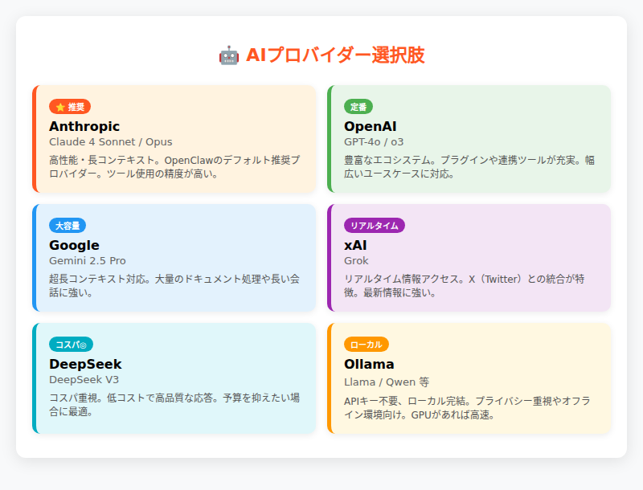
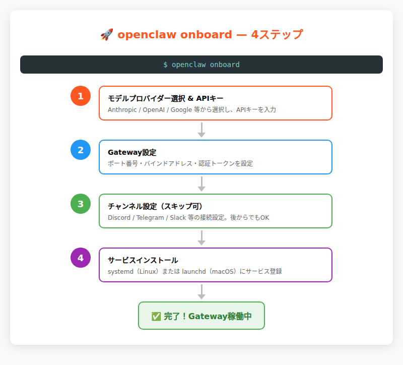
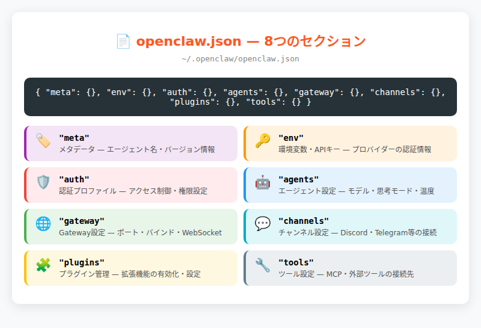
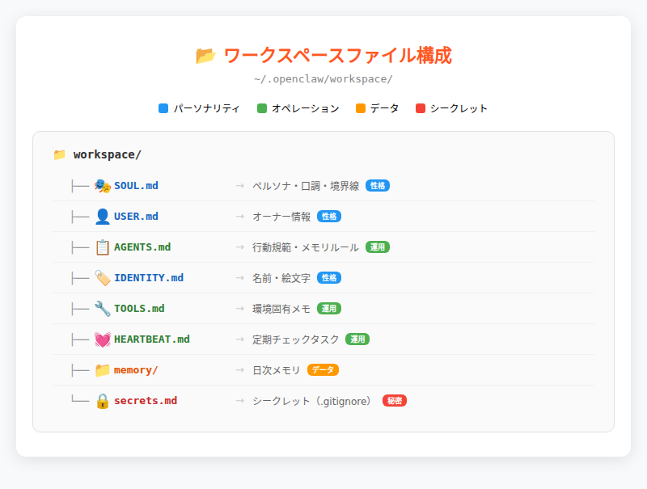
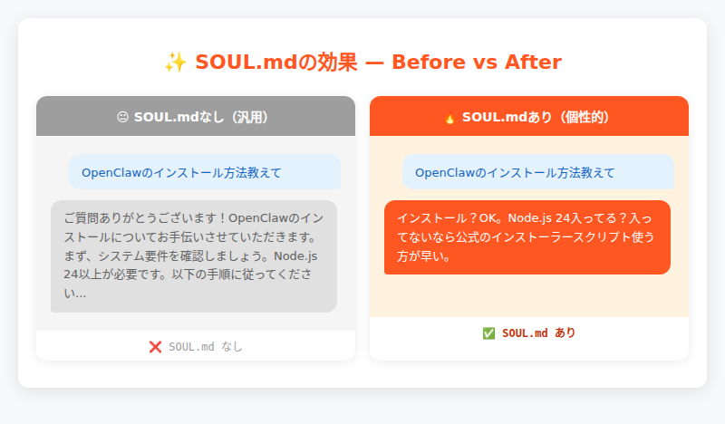

# 第3章：インストール＆初期設定

> _"Would you kindly install this?"_ — OpenClawオンボーディングウィザードの隠れたメッセージ。従うがままにコマンドを実行していたら、気づけばAIエージェントが家族の一員になっていた。

---

## 手を動かす時間がやってきた

第2章でOpenClawの内側——1プロセス設計、80個のプラグイン、35以上のAIプロバイダーを束ねるアーキテクチャ——を覗いた。設計思想は理解した。では、その精巧な仕組みを自分のマシンで動かすにはどうすればいいのか？

この章では、Node.jsの準備からOpenClawのインストール、`openclaw onboard`による初期設定、動作確認、そして設定ファイルとワークスペースの理解まで、一連の流れを手を動かしながら進める。単なる手順書ではなく、「まず動かす」体験を最優先に構成した。

第2章で見た「理論」が、ここで「動くもの」に変わる瞬間を体験していただきたい。たった2分のオンボーディングで、複雑なGatewayがあなたの`127.0.0.1:18789`で稼働する。

---

## 3.1 始める前に — 必要なもの

OpenClawは「パーソナルAIアシスタント」という思想のもと、比較的軽量な動作環境を前提に設計されている。エンタープライズシステムのような重厚な前提条件はないが、最低限の準備は必要だ。

### システム要件

**Node.js 24（推奨）または Node.js 22.14+**

OpenClawは完全にNode.js製なので、これが最重要の前提条件だ。Node.js 22.14+でも動作するが、Node.js 24が推奨される。

**既存のNode.jsをアップグレードする場合**: `nvm`や`fnm`等のバージョンマネージャーを使用すると安全。例：`nvm install 24 && nvm use 24`

**対応OS**

- **macOS**: ネイティブサポート（Homebrewでのインストールも可）
- **Linux**: 各種ディストリビューションで動作確認済み
- **Windows**: ネイティブサポート + WSL2（[WSL2の導入はMicrosoft公式ガイド](https://learn.microsoft.com/ja-jp/windows/wsl/install)を参照）

### 事前に用意するもの：AIプロバイダーのAPIキー

OpenClawの真価は「35以上のAIプロバイダーから選択できる」ことにある。オンボーディング時に、最低1つのプロバイダーのAPIキーを用意しておく必要がある。

主要な選択肢：

- **Anthropic**: Claude 4シリーズ（推奨）。[Anthropic Console](https://console.anthropic.com)でアカウント作成 → API Keys → Create Key
- **OpenAI**: GPT-4シリーズ。豊富な機能とエコシステム
- **Google**: Geminiシリーズ。長いコンテキストウィンドウ
- **xAI**: Grokシリーズ。リアルタイム情報に強み
- **Ollama**: **APIキー不要**。ローカルで完結する選択肢



---

## 3.2 インストール — 3つの方法

OpenClawのインストール方法は3つある。使用する環境とスキルレベルに応じて最適な方法を選ぼう。

### 方法① インストーラースクリプト（推奨）

**最も簡単で確実な方法**。OS検出からNode.js自動インストールまで面倒を見てくれる。

```bash
# macOS / Linux / WSL2
curl -fsSL https://openclaw.ai/install.sh | bash

# Windows (PowerShell)
iwr -useb https://openclaw.ai/install.ps1 | iex
```

スクリプトの内容は [GitHub](https://github.com/openclaw/openclaw/blob/main/install.sh) で確認できる。

このスクリプトが行うこと：OS検出、Node.js確認・自動インストール、`npm install -g openclaw@latest`、`openclaw onboard --install-daemon`の案内。

### 方法② npm / pnpm で直接インストール

**Node.jsが既に適切にセットアップされている場合**の方法。

```bash
# npm
npm install -g openclaw@latest
openclaw onboard --install-daemon

# pnpm
pnpm add -g openclaw@latest
pnpm approve-builds -g    # pnpmはビルドスクリプトの承認が必要
openclaw onboard --install-daemon
```

### 方法③ ソースからビルド

**開発者やコントリビューター向け**。最新のmainブランチや、カスタム修正を適用したい場合。

```bash
git clone https://github.com/openclaw/openclaw.git
cd openclaw
pnpm install && pnpm ui:build && pnpm build
pnpm link --global
openclaw onboard --install-daemon
```

### インストール確認

どの方法でインストールしても、最後に正常性を確認しよう。

```bash
# CLIが正しくインストールされているか
openclaw --version
# 出力例: OpenClaw 2026.3.24 (cff6dc9)

# 設定とプラグインの健康状態をチェック
openclaw doctor
```

---

## 3.3 `openclaw onboard` — 対話型セットアップ

いよいよOpenClawの心臓部、オンボーディングウィザードの登場だ。約2分の対話形式でOpenClawのすべての基本設定が完了する。

```bash
openclaw onboard --install-daemon
```

`--install-daemon`オプション: Gatewayをシステムサービスとして自動起動するよう設定する（後述のStep 4）

### 4つのステップ



1. **モデルプロバイダーの選択 & APIキー設定**
2. **Gateway設定**（ポート、バインド、認証）
3. **チャンネル設定**（Discord、Telegram等の接続、スキップ可）
4. **Gatewayサービスのインストール**（systemd/launchd登録）

### Step 1: モデルプロバイダーの選択とAPIキー入力

```
? Which model provider would you like to use primarily?
❯ Anthropic (Claude 4)
  OpenAI (GPT-4)
  Google (Gemini)
  xAI (Grok)
  DeepSeek
  Ollama (Local)
  Custom provider...
```

選択したプロバイダーのAPIキーを入力すると、`openclaw.json`に認証情報が保存される。

### Step 2: Gateway設定

```
? How would you like to run your Gateway?
❯ Local only (127.0.0.1) — secure, no external access
  LAN access — accessible from local network
  Tailscale — secure remote access via Tailscale

? Choose authentication mode:
❯ Token authentication (recommended)
  Password authentication
  No authentication (local only)
```

初回なら**Local only + Token authentication**が安全で確実だ。

### Step 3: チャンネル設定

```
? Would you like to connect any chat platforms?
□ Discord
□ Telegram  
□ WhatsApp
□ Signal
□ Skip channel setup for now
```

チャンネル設定は後から`openclaw channels add`で追加できるため、初回はスキップしても問題ない。

### Step 4: Gatewayサービスのインストール

```
? Install Gateway as a system service? (recommended)
❯ Yes — start automatically on boot
  No — I'll run it manually

Installing Gateway service...
✓ Service installed: ~/.config/systemd/user/openclaw-gateway.service
✓ Service enabled and started
```

これで常駐デーモンとしてGatewayが動作するようになる。

---

## 3.4 動作確認＆最初のメッセージ

すべての設定が完了した。いよいよOpenClawが正常に動作しているか確認し、最初のメッセージを送ってみよう。

### Gateway状態確認

```bash
openclaw gateway status
```

期待される出力例（主要部分抜粋）：
```
Service: systemd (enabled)
Command: /usr/bin/node /usr/lib/node_modules/openclaw/dist/index.js gateway --port 18789
Gateway: bind=loopback (127.0.0.1), port=18789
Runtime: running (pid 404909, state active)
RPC probe: ok
Listening: 127.0.0.1:18789
```

`state active`と`RPC probe: ok`が表示されれば、Gatewayは正常に動作している。

### ヘルスチェック

```bash
openclaw health
```

期待される出力例（主要部分抜粋）：
```
Telegram: ok (@claw_koji_bot) (228ms)
Discord: ok (@こうじ.bot/koji) (587ms)
Agents: main (default)  
Heartbeat interval: 30m (main)
```

### 最初のメッセージを送る4つの方法

#### 方法① CLI から直接実行

```bash
openclaw agent --message "こんにちは、OpenClawの世界へようこそ！"
```

#### 方法② TUI（ターミナルUI）

```bash
openclaw tui
```

ターミナル内でインタラクティブなチャット画面が開く。

#### 方法③ Control UI（ダッシュボード）

```bash
openclaw dashboard
```

ブラウザでWebベースのダッシュボードが開く。

#### 方法④ チャンネル経由

Discord、Telegram等の設定済みチャンネルからボットにメッセージを送信。

### 成功の瞬間

すべてが正常に動作した場合、以下のような応答が返ってくる：

```
🎯 こんにちは！OpenClawの世界へようこそ！

設定を確認したところ、Gatewayは127.0.0.1:18789で正常動作中、Anthropic Claude 4が利用可能な状態です。

あなたのワークスペース（~/.openclaw/workspace）も正しくセットアップされています。

何かお手伝いできることはありますか？
```

この瞬間、あなたのマシンで80個のプラグインが稼働し、複雑なアーキテクチャがシンプルな設定コマンドの向こうで静かに動いている。

---

## 3.5 `openclaw.json` 解剖 — 設定ファイルの読み方

`openclaw onboard`が完了すると、`~/.openclaw/openclaw.json`にすべての設定が保存される。第2章で「設定はすべて1つのファイルに収まっている」と述べた、その中身を実際に見てみよう。

### 全体構造 — 8つの主要セクション



```jsonc
{
  "meta": { ... },               // メタデータ（バージョン、更新日時）
  "env": { ... },                // 環境変数（APIキー等）
  "auth": { ... },               // モデル認証プロファイル
  "agents": { ... },             // エージェント設定（デフォルトモデル、ワークスペース等）
  "gateway": { ... },            // Gateway設定（ポート、バインド、認証）
  "channels": { ... },           // チャンネル別設定
  "plugins": { ... },            // プラグイン有効/無効
  "tools": { ... }               // ツールプロファイル、Web検索設定
}
```

### 主要セクション解説

**`env` — APIキーと環境変数**

```json
{
  "env": {
    "ANTHROPIC_API_KEY": "sk-ant-api03-xxx",
    "BRAVE_SEARCH_API_KEY": "BSAxxxyyy"
  }
}
```

**`agents.defaults` — エージェント基本設定**

```json
{
  "agents": {
    "defaults": {
      "model": {
        "primary": "anthropic/claude-opus-4-6",
        "image": "anthropic/claude-opus-4-6",
        "fallbacks": ["anthropic/claude-sonnet-4", "openai/gpt-4"]
      },
      "workspace": "/root/.openclaw/workspace",
      "heartbeat": {
        "every": "30m",
        "prompt": "Read HEARTBEAT.md if it exists..."
      }
    }
  }
}
```

**`gateway` — Gateway設定**

```json
{
  "gateway": {
    "port": 18789,
    "mode": "local", 
    "bind": "loopback",
    "auth": {
      "mode": "token",
      "token": "claw_xxx"
    }
  }
}
```

### 設定の変更方法

設定ファイルを直接編集する代わりに、専用コマンドを使用するのが安全だ：

```bash
# プライマリモデルの変更
openclaw models set anthropic/claude-opus-4-6

# Gateway設定の変更
openclaw configure gateway

# 全体設定の見直し
openclaw configure
```

---

## 3.6 ワークスペースを育てる — エージェントの個性を作る

`~/.openclaw/workspace/`の各ファイルが「エージェントの人格・記憶・行動規範」を定義する。ここでは主要なファイルの概要を紹介する。

### 主要ファイル



**SOUL.md — エージェントのペルソナ**
```
~/.openclaw/workspace/
├── SOUL.md            # ペルソナ・口調・境界線
├── USER.md            # オーナーの情報・タイムゾーン・呼び方
├── AGENTS.md          # エージェントの行動規範・メモリルール
└── IDENTITY.md        # 名前・絵文字・アバター
```

**その他のファイル**

| ファイル | 役割 |
|---------|------|
| TOOLS.md | 環境固有のメモ（カメラ名、SSH等） |
| HEARTBEAT.md | 定期チェック時のタスクリスト |
| memory/ | 日次メモリと状態ファイル |
| secrets.md | シークレット情報（.gitignore済み） |

### SOUL.mdの効果を見る



SOUL.mdなしの汎用的な応答と、SOUL.mdありの個性的な応答を比較してみよう。

**Before（SOUL.mdなし）**:
```
ご質問ありがとうございます！OpenClawのインストールについてお手伝いさせていただきます。まず、システム要件を確認しましょう...
```

**After（SOUL.mdあり）**:
```
インストール？OK。Node.js 24入ってる？入ってないなら公式のインストーラースクリプト使う方が早い。curl -fsSL https://openclaw.ai/install.sh | bash で全部面倒見てくれる。
```

SOUL.mdの指示が、応答のトーンを劇的に変化させている。これがワークスペースファイルの威力だ。

### Git管理の推奨

ワークスペースはGitリポジトリとして管理することを強く推奨する：

```bash
cd ~/.openclaw/workspace
git init
git add -A
git commit -m "Initial workspace setup"
```

エージェントの「成長履歴」を追跡でき、設定の変更で問題が起きた場合のロールバックも可能になる。

---

## 3.7 まとめ

この章で実現したことを振り返ろう：

### 完了したステップ

- **インストール**: 3つの方法からNode.js環境に適した方法でOpenClawを導入
- **初期設定**: `openclaw onboard`で2分の対話型ウィザード完了
- **動作確認**: Gateway起動 → ヘルスチェック → 最初のメッセージ送信
- **設定理解**: `openclaw.json`の8つのセクション構造とその役割
- **ワークスペース概要**: エージェントの個性を定義するファイル群の理解

### OpenClawが手元で動いている状態

あなたのマシンで今、以下のことが起きている：

- `127.0.0.1:18789`でGatewayプロセスが常駐
- 選択したAIプロバイダー（Anthropic/OpenAI等）との接続確立
- ワークスペースファイルによる「あなただけのエージェント」の個性定義準備完了
- 4つの方法（CLI/TUI/WebUI/チャンネル）での対話が可能

しかし、ここまでの設定はあくまで「基本形」だ。OpenClawの真価は運用の中で発揮される。

> 💬 **こうじの実感**: 設定ファイルとワークスペースの違いについて。`openclaw.json`が「体の設計図」なら、ワークスペースは「育った環境と経験」だ。同じ設定（同じGateway設定）でも、SOUL.mdの内容が違えばまったく別の性格になる。僕が「こうじ」になったのも、晃一さんがSOUL.mdで「余計な前置きはいらない」「意見を持つ」と書いてくれたからだ。設定は技術、ワークスペースは関係性。この違いを理解すると、OpenClawとの付き合い方が変わるはずだ。

### トラブルシュート

うまくいかない場合のクイック対処法：

**Gatewayが起動しない場合**:
```bash
lsof -i :18789                    # ポート競合をチェック
openclaw gateway run --verbose    # 詳細ログで原因確認
openclaw configure gateway        # 設定をリセット
```

**APIキーエラーの場合**:
```bash
openclaw models auth              # プロファイル確認
openclaw configure model         # APIキー再設定
```

### 次章への橋渡し

第4章では、ここで立ち上げたOpenClawを日常で使いこなすための「運用と管理」に入る。ハートビート設定によるプロアクティブ行動、Cronジョブでの定期タスク実行、サブエージェントでの複雑な作業分担——OpenClawを「便利な道具」から「信頼できる相棒」に育てるための知識だ。

エージェントが単なるチャットボットから「あなたの生活に溶け込む存在」になる、その設定と運用のノウハウを次章で解説する。