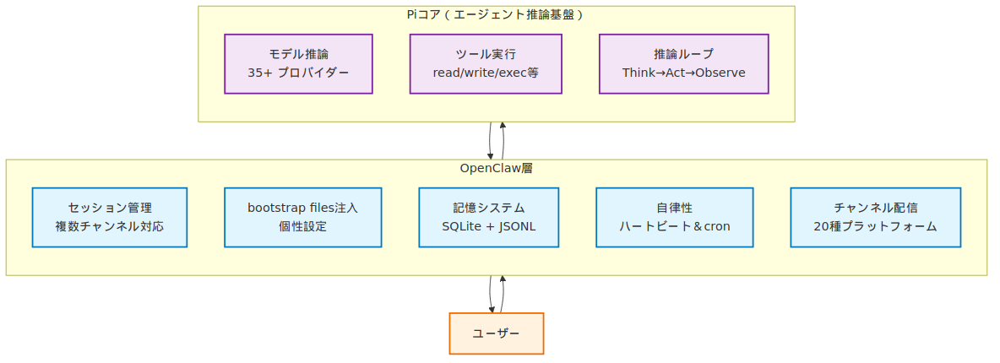
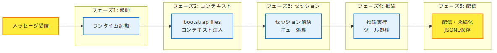
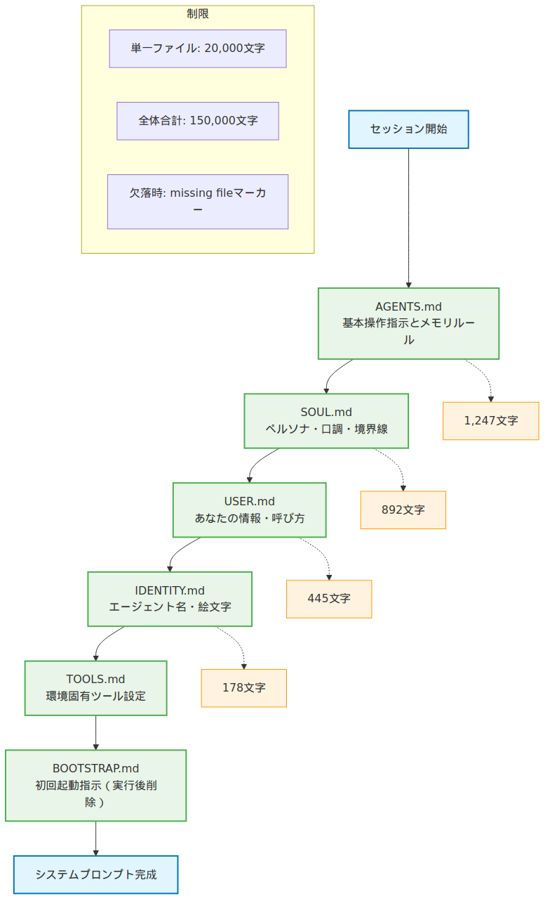
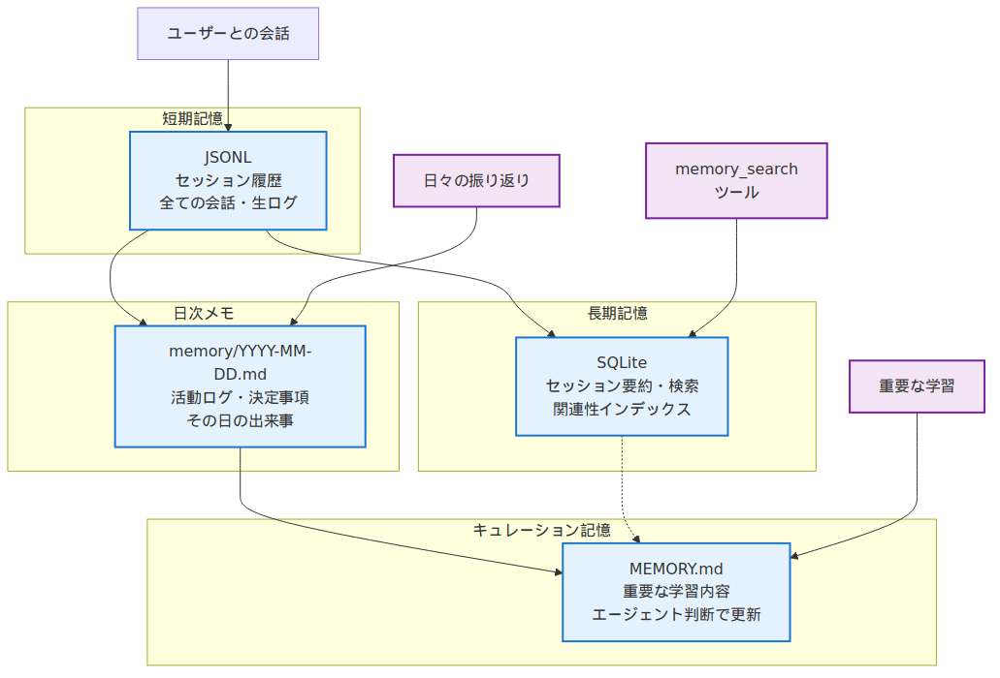
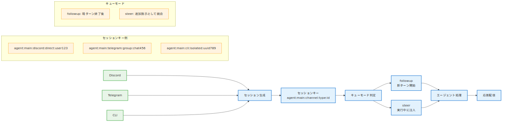
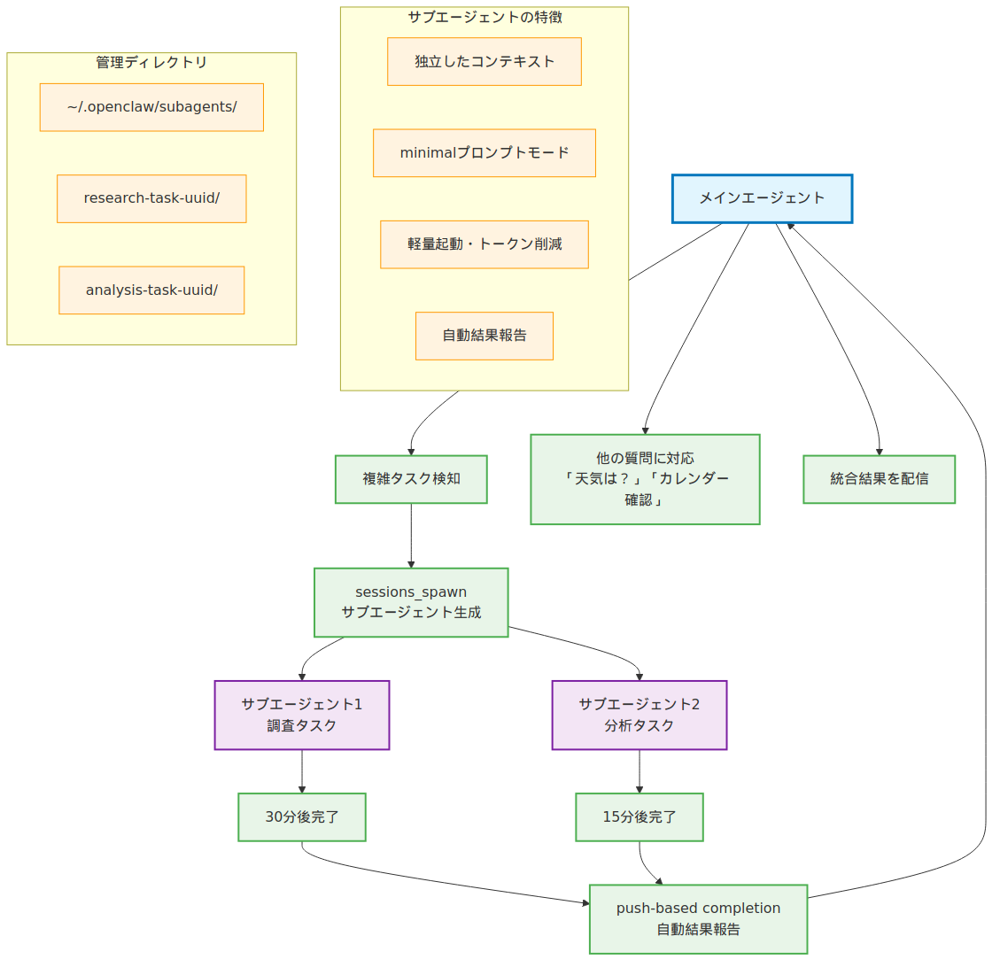
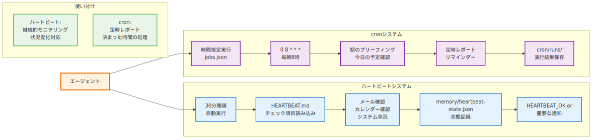

# 第4章：エージェントの仕組み

> _"The mind of an AI agent is like an onion — it has many layers, and sometimes it makes you cry when you try to understand it all at once."_ — あるOpenClaw開発者の実録。第3章でインストールしたGatewayの奥で、一体何が動いているのか？

---

## ブラックボックスを透明にする時間

第3章でOpenClawを起動し、最初のメッセージを送った時、あなたは確かに「動いている」ことを体験した。しかし、その舞台裏で何が起きていたのか？メッセージを送信してから応答が返ってくるまでの数秒間に、Gatewayの中でどんな処理が展開されていたのか？

この章では、OpenClawエージェントの「心の内側」を解剖する。単なる「動くもの」から「理解できるシステム」へと、あなたの理解を一段深める。第2章のアーキテクチャ図で見た「Agent」の箱の中身——2層構造、ライフサイクル、記憶システム、セッション管理——これらすべてを実際のファイルと動作ログを見ながら紐解いていく。

OpenClawのエージェントは決して魔法ではない。Piエージェントコア（モデル、ツール、プロンプトパイプライン）という確固とした基盤の上に、OpenClaw独自のセッション管理、記憶システム、自律性の仕組みが重なっている。そして、その全体をワークスペースの6つのファイル（bootstrap files）があなた専用にカスタマイズしている。

---

## 4.1 エージェントとは何か — 2層構造の正体

OpenClawの「エージェント」は、実は2つの層から構成されている。下層のPiエージェントコア（汎用AIエージェント実行基盤）と、上層のOpenClaw層（セッション管理・記憶・チャンネル配信）が連携して、あなたが体験する「賢いAIアシスタント」を実現している。

### Piエージェントコア — 思考と実行の基盤

Piコアは「純粋なAIエージェント」として以下を担当する：

- **モデル推論** — 35以上のプロバイダーの中から選択されたLLM（Claude 4、GPT-4等）とのやりとり
- **ツール実行パイプライン** — `read`、`write`、`exec`等の組み込みツールと外部スキルを統合
- **推論ループ** — モデルが「ツールを使う」→「結果を得る」→「さらに考える」の反復実行。トークン（AIモデルが処理するテキストの単位）効率を維持しながら複雑なタスクを実行

Piコアは汎用設計で、OpenClaw以外の環境でも動作する（例：単体のCLI、他のプラットフォーム統合）。

### OpenClaw層 — パーソナライゼーションとコミュニケーション

OpenClaw層はPiコアを「パーソナルAIアシスタント」に変える：

- **セッション管理** — Discord、Telegram、CLI等の複数チャンネルでの会話継続性
- **bootstrap files注入** — SOUL.md（ペルソナ）、USER.md（あなたの情報）等による個性づくり  
- **記憶システム** — SQLite + JSONLによる長期記憶とメモリ検索
- **自律性** — ハートビート（定期チェック）とcronによるプロアクティブ行動
- **チャンネル配信** — 20種類のプラットフォームへの応答配信とストリーミング

この2層設計により、「汎用的で強力な推論能力」と「パーソナルで継続的な関係性」が両立している。



---

## 4.2 エージェントライフサイクル — 起動から応答まで

「こんにちは、OpenClaw」とメッセージを送信してから応答が返るまで、エージェントは以下の5つのフェーズを経る。実際の処理を`openclaw agent --message "テスト" --verbose on`で観察してみよう。

### フェーズ1: 起動とランタイム初期化

```
[Gateway] CLI respawn準備...
[Gateway] エージェントランタイム初期化 (Node.js v24.7.0)
[Runtime] workspace検証: /root/.openclaw/workspace
```

Gatewayが`/usr/lib/node_modules/openclaw/dist/entry.js`からエージェントランタイムを起動し、ワークスペース（第3章で設定した）の存在確認を行う。

### フェーズ2: コンテキストファイル注入

```
[Bootstrap] AGENTS.md → システムプロンプト注入 (1,247文字)
[Bootstrap] SOUL.md → ペルソナ注入 (892文字) 
[Bootstrap] USER.md → プロフィール注入 (445文字)
[Bootstrap] IDENTITY.md → エージェント名注入 (178文字)
```

ワークスペースの6つのbootstrap files（詳細は4.3で解説）を順次読み込み、システムプロンプトに注入する。これがエージェントの「個性」と「記憶」の基盤となる。

### フェーズ3: セッション解決とキュー処理

```
[Session] キー解決: agent:main:cli:isolated:5f8a2c3b
[Queue] followup モード: 現在実行なし、即座に開始
```

送信元（CLI、Discord、Telegram等）とユーザー識別子の組み合わせからセッションキーを生成。既存セッション履歴をロードし、処理順序を制御する。

### フェーズ4: プロンプト構築と推論実行

```
[Context] システムプロンプト: 7セクション、総計4,892文字
[Model] anthropic/claude-sonnet-4-20250514 → リクエスト送信
[Tools] ツール呼び出し: read('/root/.openclaw/workspace/README.md')
[Model] ツール結果統合 → 最終応答生成
```

Piコアがプロンプトを構築し、選択されたモデル（Anthropic、OpenAI等）にリクエスト送信。ツール実行が必要なら実行し、結果を統合して最終応答を生成する。

### フェーズ5: 配信と永続化

```
[Stream] 応答配信開始: 38文字チャンク
[Session] JSONL永続化: ~/.openclaw/agents/main/sessions/5f8a2c3b.jsonl
[Lifecycle] ターン完了: 2.4秒
```

生成された応答をリアルタイムストリーミング配信し、セッション履歴をJSONLファイルに保存して完了。



---

## 4.3 bootstrap files — エージェントの個性を作る6つのファイル

ワークスペースの6つのファイルが、エージェントの「魂」を定義している。これらは新しいセッション開始時に**決まった順序で**システムプロンプトに注入される。実際に各ファイルを編集して、エージェントの応答がどう変化するかを体験してみよう。

### 注入順序とその意味

1. **AGENTS.md** — 基本操作指示とメモリルール
2. **SOUL.md** — ペルソナ、口調、境界線の定義
3. **USER.md** — あなたの情報（名前、タイムゾーン、呼び方）  
4. **IDENTITY.md** — エージェント名、雰囲気、絵文字
5. **TOOLS.md** — 環境固有ツール設定（カメラ名、SSH等）
6. **BOOTSTRAP.md** — 初回起動時のみの指示（完了後削除）

この順序は重要だ。SOUL.mdが「ペルソナ」を定義した後に、USER.mdが「相手の情報」を注入することで、適切な関係性が構築される。

### 実践：SOUL.mdの編集で応答を変える

第3章で作成されたSOUL.mdを編集して、エージェントの口調を変化させてみよう。

```bash
# 現在のSOUL.mdを確認
cat ~/.openclaw/workspace/SOUL.md

# エディタで編集
edit ~/.openclaw/workspace/SOUL.md
```

SOUL.mdに以下を追加：
```markdown
## 口調設定
- 関西弁で応答する
- 「〜やで」「〜やん」を多用する
- フレンドリーだが敬語は使わない
```

変更後にメッセージを送信すると：

**変更前**:
```
こんにちは！OpenClawのセットアップは正常に完了しています。何かお手伝いできることがあれば教えてください。
```

**変更後**:
```
おっ、こんにちは〜！OpenClawの調子はバッチリやで。何か手伝えることあったら遠慮せんと言うてな〜
```

この変化は、SOUL.mdがシステムプロンプトに直接注入され、モデルの応答パターンを制御しているためだ。

### ファイルサイズと制限

bootstrap filesには以下の制限がある：

- **単一ファイル制限**: 20,000文字（`bootstrapMaxChars`）
- **全体制限**: 150,000文字（`bootstrapTotalMaxChars`）
- **欠落処理**: ファイルが存在しない場合、"missing file"マーカーが注入

大きなファイルは自動的に切り詰められ、トークン効率を維持する。



---

## 4.4 記憶メカニズム — SQLite + JSONL のハイブリッド設計

OpenClawの「記憶」は複数のストレージシステムで構成されている：短期記憶（JSONL形式のセッション履歴）と長期記憶（SQLiteデータベース＋memory_searchツール）。JSONL（1行1JSONのテキスト形式）により、各セッションの会話が構造化データとして保存される。

### 短期記憶：セッション履歴（JSONL）

各セッションの会話は`~/.openclaw/agents/main/sessions/<SessionId>.jsonl`に保存される。

```bash
# 最新のセッションファイルを確認
ls -la ~/.openclaw/agents/main/sessions/ | tail -n 3
cat ~/.openclaw/agents/main/sessions/<最新のSessionId>.jsonl | head -n 5
```

JSONLファイルの1行が1つのターンを表す：
```json
{"role":"user","content":"OpenClawの仕組みを教えて","timestamp":"2026-03-28T05:00:00Z"}
{"role":"assistant","content":"OpenClawは2層構造で...","timestamp":"2026-03-28T05:00:15Z"}
```

### 長期記憶：SQLiteデータベース

SQLiteデータベース（`/root/.openclaw/memory/main.sqlite`）に、すべてのセッションの要約とインデックスが保存される。

```bash
# memory_searchツールで検索してみる
openclaw agent --message "memory_search で「インストール」に関する過去の会話を探して"
```

メモリ検索により、数ヶ月前の会話内容も関連性に基づいて取得できる。これがOpenClawが「覚えている」仕組みの正体だ。

### メモリファイルシステム

ワークスペースには以下のメモリファイルが作成される：

```
~/.openclaw/workspace/
├── memory/
│   ├── 2026-03-28.md      # 今日の活動ログ（自動作成）
│   ├── 2026-03-27.md      # 昨日のログ
│   └── heartbeat-state.json # ハートビート状態
└── MEMORY.md              # キュレーションされた長期記憶
```

### 記憶データの棲み分け

各記憶システムが保存するデータは以下のように分かれている：

- **セッション履歴（JSONL）**: 全ての会話のやりとり、生ログ
- **長期記憶（SQLite）**: セッション要約、検索インデックス、関連性データ
- **日次メモ（memory/YYYY-MM-DD.md）**: その日の活動ログ、決定事項
- **キュレーション記憶（MEMORY.md）**: エージェントが重要と判断した学習内容

MEMORY.mdはエージェントが日々の活動から得た学習内容や重要な決定事項を、自らの判断で記録・更新するファイルだ。



---

## 4.5 セッション管理 — 複数の会話を同時に処理する仕組み

OpenClawは複数のチャンネル（Discord、Telegram、CLI等）で同時に会話を処理できる。これは**セッションキー**による分離と、**キューモード**による実行制御で実現されている。

### セッションキーの命名規則

すべてのセッションは以下の形式で識別される：
```
agent:<agentId>:<channel>:<type>:<identifier>
```

実例：
- `agent:main:discord:direct:user123` — Discord DM
- `agent:main:telegram:group:chat456` — Telegramグループチャット  
- `agent:main:cli:isolated:uuid789` — CLI単発実行

### 主要な3つのセッションタイプ

まず基本的な3つのタイプを理解しよう：

| タイプ | 用途 | 例 |
|--------|------|----| 
| `main` | メインセッション | あなたとの直接的な1対1チャット |
| `group` | グループ/チャンネル | Discord公開チャンネル、複数人参加 |
| `isolated` | 分離実行 | CLI単発実行、cronジョブ |

他にも`dm`（個人チャット）、`channel`（特定チャンネル）、`subagent`（サブエージェント）等のタイプがあるが、基本はこの3つの組み合わせで理解できる。

### キューモードによる実行制御

同一セッション内で複数のメッセージが送信された場合、以下のモードで処理される：

- **followup** — 現在のターン終了後に新ターン開始（最も一般的）
- **steer** — 実行中の処理に注入（追加指示として統合）

具体例：あなたが「資料調査して」と送信した後、エージェントが調査中に「急ぎなので簡潔版で」と追加すると、steerモードで追加指示が統合され、簡潔な調査レポートが生成される。



---

## 4.6 マルチエージェント — サブエージェントと分業の思想

## なぜサブエージェントが必要か？

実際のシナリオで考えてみよう：

**シナリオ1**: あなたが「競合他社の調査レポートを作成して」と依頼。この調査には30分かかるが、その間に「今日の天気は？」や「カレンダーの確認お願い」といった別の質問もしたい。

**従来の問題**: メインエージェントが調査中は他の質問に応答できない。30分間「お待ちください」状態。

**OpenClawの解決**: メインエージェントがサブエージェントに調査を委託し、自分は別の質問に即座に対応。サブエージェントが完了すると、push-based completion（タスク完了時に自動通知する方式）により結果が自動報告される。

複雑なタスクや時間のかかる処理は、このようにメインエージェントがサブエージェントに分業させることができる。これが`sessions_spawn`ツールによるマルチエージェント機能だ。

### サブエージェントの生成と管理

サブエージェントは以下のようにして生成される：

```javascript
// エージェントが内部で実行するツール呼び出し例
sessions_spawn({
  label: "research-task",
  model: "anthropic/claude-sonnet-4",
  message: "Go プログラミング言語について詳細調査してレポートを作成してください",
  timeoutSeconds: 1800
})
```

サブエージェントの特徴：
- **独立したコンテキスト** — minimalプロンプトモード（AGENTS.md、TOOLS.mdのみ注入）
- **軽量起動** — SOUL.md、USER.md等はフィルタされトークン消費を削減
- **自動報告** — 完了時に結果を親エージェントに push-based で通知

### サブエージェント管理ディレクトリ

```
~/.openclaw/subagents/
├── research-task-uuid123/
│   ├── session.jsonl          # サブエージェントのセッション履歴
│   └── metadata.json          # 実行メタデータ
└── analysis-task-uuid456/
```

### push-based completion（自動通知）の威力

サブエージェントは親エージェントの実行を「待たせない」。従来のシステムなら「タスク完了したかな？」と定期的にチェック（ポーリング）が必要だが、OpenClawではタスク完了時に自動的に結果を報告するため、効率的な分業管理が実現される。

実践例：
```
[メイン] サブエージェントに調査タスクを依頼中...
[サブ] 30分後に調査完了、結果を自動報告
[メイン] サブエージェント完了通知を受信、結果を統合
```



---

## 4.7 自律性の基盤 — ハートビートとcronシステム

OpenClawのエージェントは「指示待ち」だけでなく、プロアクティブに行動する。これがハートビート（30分間隔の定期チェック）とcronシステム（時間指定実行）による自律性だ。

### ハートビートシステム

デフォルト設定では30分ごとに以下のプロンプトが実行される：
```
Read HEARTBEAT.md if it exists (workspace context). Follow it strictly. Do not infer or repeat old tasks from prior chats. If nothing needs attention, reply HEARTBEAT_OK.
```

HEARTBEAT.mdを作成することで、定期的にチェックする項目をカスタマイズできる：

```bash
# HEARTBEAT.mdの作成例
cat > ~/.openclaw/workspace/HEARTBEAT.md << 'EOF'
# 定期チェック項目

## メール
- 未読メールの確認（重要度高のもの）

## カレンダー
- 次24時間のイベント確認

## システム
- ディスク容量チェック
- 重要なログ確認

最後にチェック状況を memory/heartbeat-state.json に記録する。
EOF
```

### cronシステム

時間を指定した定期実行には`/root/.openclaw/cron/jobs.json`を使用する：

```json
{
  "jobs": [
    {
      "id": "morning-briefing",
      "schedule": { "kind": "cron", "expr": "0 8 * * *", "tz": "Asia/Tokyo" },
      "sessionTarget": "main", 
      "payload": {
        "kind": "agentTurn",
        "message": "今日の予定とタスクを確認して朝のブリーフィングを送って",
        "timeoutSeconds": 600
      }
    }
  ]
}
```

cronジョブの実行結果は`/root/.openclaw/cron/runs/`に保存される。

### ハートビート vs cronの使い分け

- **ハートビート**: 継続的モニタリング、状況変化への対応
- **cron**: 定時レポート、決まった時間の処理、リマインダー



---

## 4.8 設定ファイル深掘り — `openclaw.json` の8つのセクション

第3章で触れた`openclaw.json`を、エージェント動作の観点から詳しく見てみよう。特に`agents.defaults`セクションがエージェントの基本動作を決定している。

### agents.defaults — エージェント基本設定

```json
{
  "agents": {
    "defaults": {
      "model": {
        "primary": "anthropic/claude-opus-4-6",
        "image": "anthropic/claude-opus-4-6", 
        "fallbacks": ["anthropic/claude-sonnet-4"]
      },
      "workspace": "/root/.openclaw/workspace",
      "heartbeat": {
        "every": "30m",
        "target": "discord",
        "to": "channel_id", 
        "session": "agent:main:discord:channel:xxx"
      },
      "blockStreamingDefault": "off"
    }
  }
}
```

### env と auth — モデル認証の仕組み

`env`セクションでAPIキーを環境変数として定義し、`auth.profiles`で認証プロファイルを設定：

```json
{
  "env": {
    "ANTHROPIC_API_KEY": "sk-ant-api03-xxx"
  },
  "auth": {
    "profiles": {
      "anthropic": {
        "apiKey": "${ANTHROPIC_API_KEY}"
      }
    }
  }
}
```

### 設定変更時のエージェント動作への影響

設定ファイルの変更は即座に反映される：

```bash
# プライマリモデルを変更
openclaw models set openai/gpt-4

# 変更確認
openclaw agent --message "今どのモデルで動いていますか？"
```

エージェントは新しい設定でシステムプロンプトを再構築し、指定されたモデルを使用して応答する。

---

## 4.9 デバッグとログ — エージェントの思考を覗く

エージェントが「何を考えているか」は、詳細ログとセッションファイルで確認できる。

### 詳細ログでライフサイクルを追跡

```bash
# 詳細ログ付きで実行
openclaw agent --message "テストメッセージ" --verbose on
```

出力例（重要部分抜粋）：
```
[Context] Bootstrap injection: 6 files, 4,892 total chars
[Session] Key: agent:main:cli:isolated:a1b2c3d4
[Model] Request: anthropic/claude-sonnet-4-20250514
[Tools] Available: read, write, edit, exec, memory_search, sessions_spawn
[Stream] Chunk: 47 chars, accumulated: 234 chars
[Lifecycle] Turn completed in 2.8 seconds
```

### セッションファイルの解析

JSONLファイルを直接解析してエージェントの処理過程を確認：

```bash
# セッションファイルの確認
cat ~/.openclaw/agents/main/sessions/<SessionId>.jsonl | jq .
```

### ヘルスチェック

システム全体の健康状態は`openclaw doctor`で確認：

```bash
openclaw doctor
```

期待される出力：
```
✓ Gateway: running on 127.0.0.1:18789
✓ Models: anthropic/claude-opus-4-6 available
✓ Workspace: /root/.openclaw/workspace valid
✓ Memory: 2.3MB database, 15 sessions
✓ Plugins: 40/80 loaded successfully
```

---

## 4.10 まとめ — エージェントと共に歩む

この章では、OpenClawエージェントの「心の内側」を解剖した。その核心は以下の3つの柱で構成されている：

### 2層アーキテクチャ
- **Piエージェントコア**: 思考と推論の基盤（汎用AIエージェント）
- **OpenClaw層**: パーソナライゼーションと継続性（セッション、記憶、チャンネル配信）

### 6つのbootstrap files
- AGENTS.md、SOUL.md、USER.md、IDENTITY.md、TOOLS.md、BOOTSTRAP.md
- エージェントの個性を定義し、新セッション時にシステムプロンプトに注入
- 編集により、応答パターンと関係性をカスタマイズ可能

### 記憶・セッション・自律性の統合
- **記憶**: SQLite（検索）+ JSONL（履歴）+ Markdown（メモ）のハイブリッド
- **セッション**: キー生成による会話分離、キューモードによる実行制御
- **自律性**: ハートビート（定期チェック）+ cron（時間指定）による能動的行動

これらの仕組みが組み合わさることで、OpenClawは単なる「チャットボット」から「継続的な関係を持つパートナー」へと進化する。第3章で立ち上げた基本形から、これであなた専用にカスタマイズされたエージェントが育っていく。

### 次章への橋渡し

第5章では、この「エージェント」が複数のプラットフォームで同時に動作する**セッション管理**の仕組みに深く入る。Discord、Telegram、WhatsApp、CLI……すべてで一貫した「記憶」と「個性」を保ちながら、どうやって複数の会話を並行処理しているのか？セッションキーの生成ルール、コンテキストの継続、グループチャットでの振る舞い——OpenClawが「どこでも同じ自分」でいられる技術の詳細を解説する。

エージェントの「心」を理解したあなたは、次にその「社交術」を学ぶことになる。