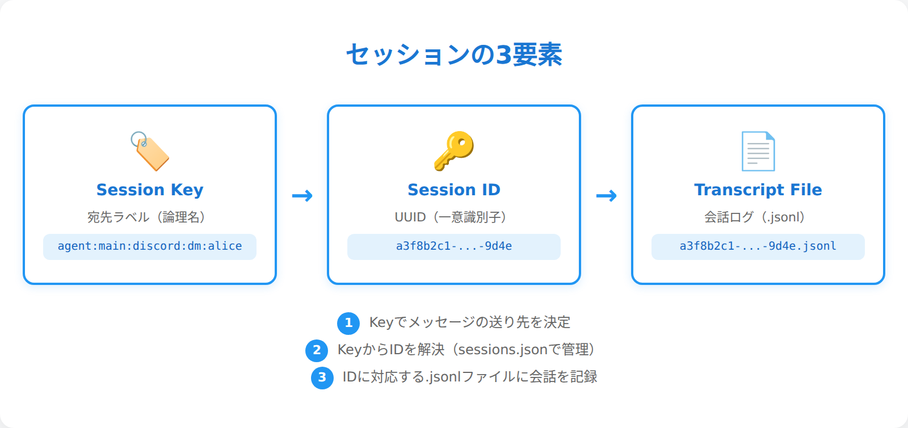
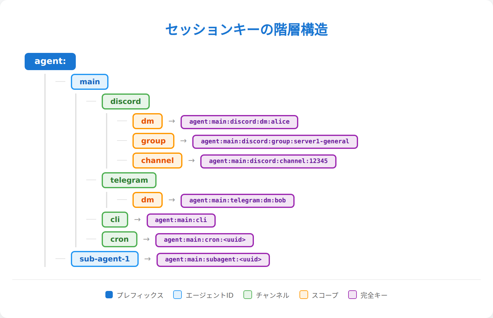
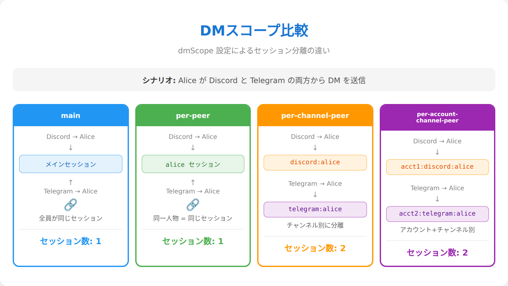
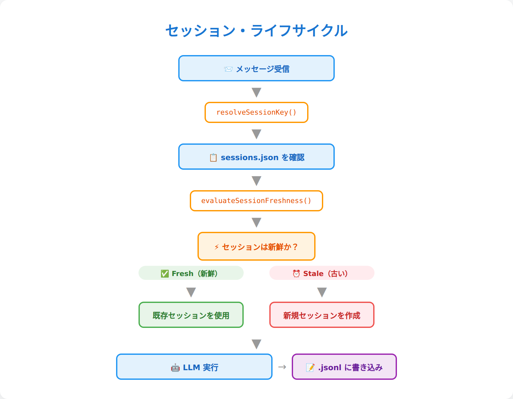
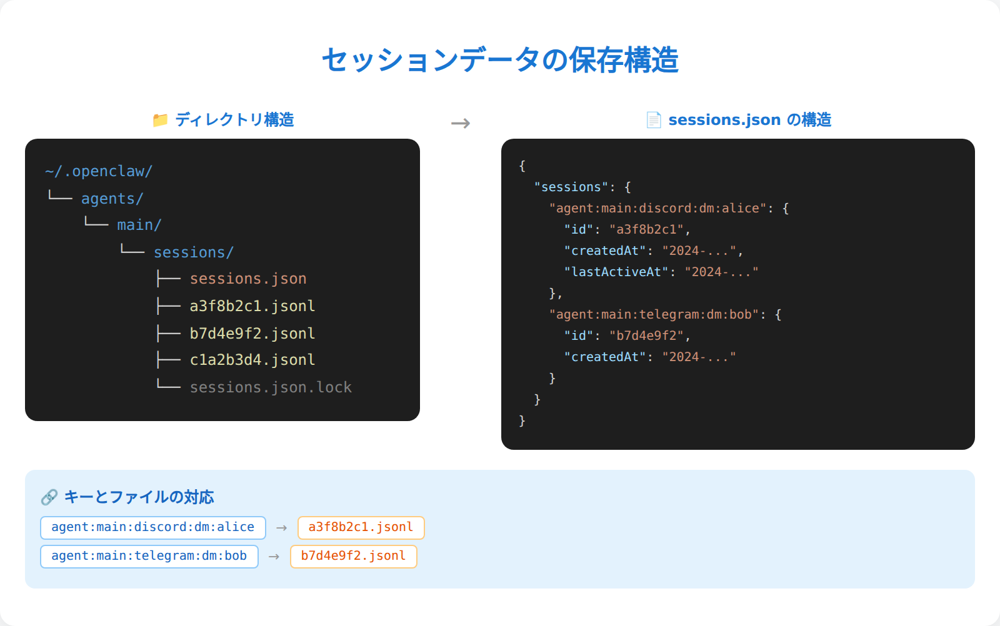
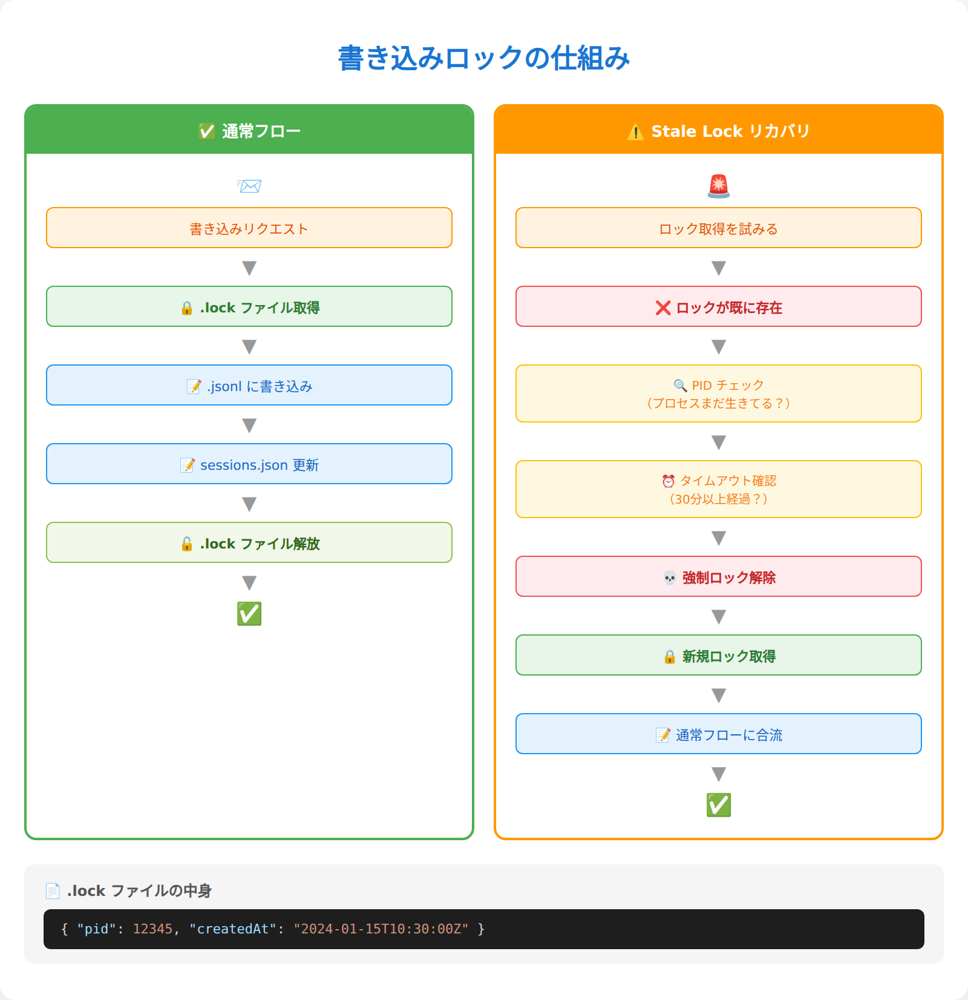
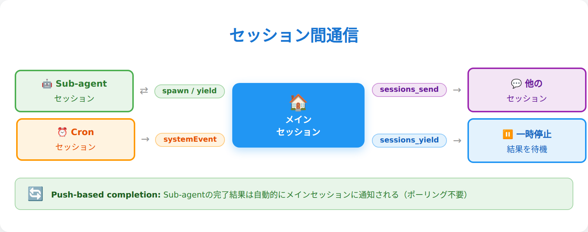
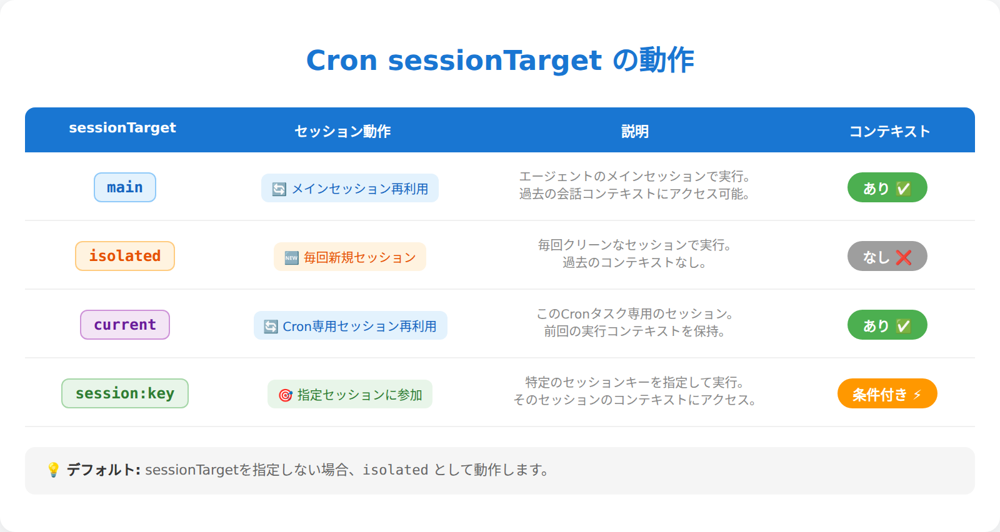
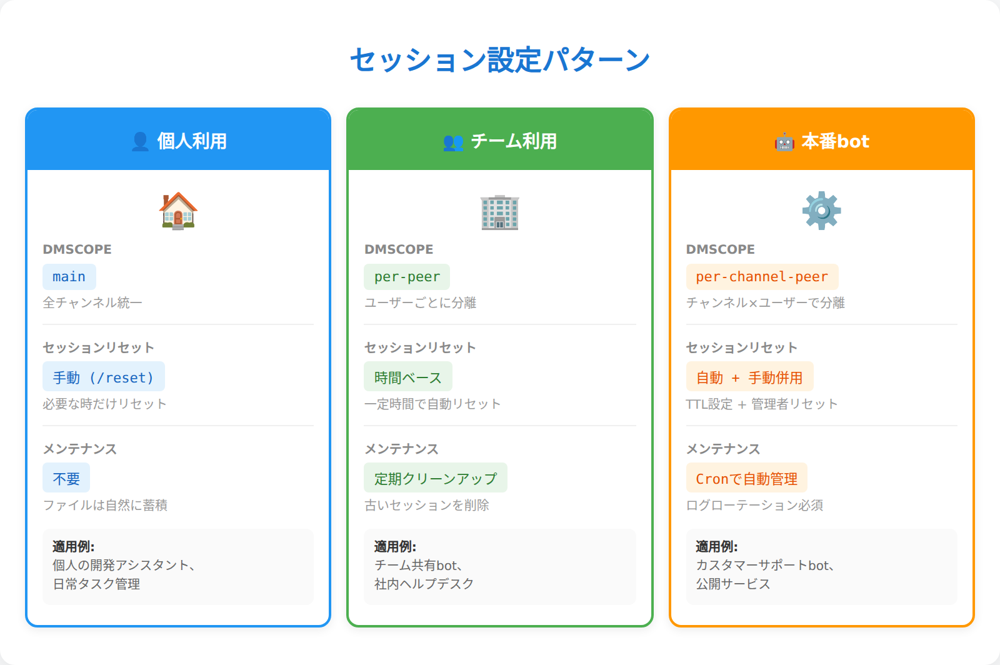

# 第5章：セッション管理

> _"I'm the same man, with the same memories... I just can't remember it in the right order."_ — The Doctor（っぽい誰か）。セッションとは「会話の糸」だ。Discord、Telegram、CLI……どのチャンネルで話しかけても、OpenClawは文脈を失わない。ただし、糸の始まりと終わりは設定次第。その魔法の正体を暴こう。

---

## 「箱」の中身を理解する時間

第4章では、エージェントの「心の内側」——2層構造、ライフサイクル、記憶メカニズム——を解剖した。4.5節でセッション管理の概要に触れ、セッションキーの命名規則と3つの基本タイプ（main、group、isolated）を紹介したのを覚えているだろうか。あの時点では「こういう仕組みがある」という予告編にとどめた。この章では、その予告編を本編に昇格させる。

OpenClawのセッション管理は、単なる「会話ログの保存」ではない。**誰と・どのチャンネルで・いつ話しているか**を自動で判別し、文脈を分離・統合・リセットする精密なシステムだ。この章を読み終える頃には、セッションキーの構造を見ただけで「あ、これはDiscord DMのper-channel-peerスコープだな」と読めるようになる。そして、自分のユースケースに合わせてスコープやリセットポリシーをカスタマイズできるようになる。

---

## 5.1 セッションとは何か — 会話コンテキストの単位

セッションとは、OpenClawにおける**会話の論理的な単位**だ。もう少し日常的に言えば、セッションは「会話の文脈を保持する箱」のようなもの。1つのセッションが1つの会話スレッドに対応し、その箱の中に「今、何について話しているか」の情報が詰まっている。

### セッションの3要素

すべてのセッションは、以下の3つの要素で成り立っている：

1. **セッションキー** — セッションを識別するための「住所」。`agent:main:discord:direct:990665...` のようなコロン区切りの文字列
2. **セッションID** — セッションに付与される一意の「個人番号」（UUID）。ファイル名にも使われる
3. **セッションファイル** — 実際の会話内容が記録される `.jsonl` ファイル。セッションの「中身」

セッションキーが「東京都渋谷区1-2-3」という住所なら、セッションIDは「マイナンバー」、セッションファイルはその住所にある「家そのもの」だと思えばいい。

### 4つの分類

第4章では便宜的に3つのタイプ（main、group、isolated）を紹介したが、内部的にはもう少し細かい分類がある。4.5節の3タイプはユースケースの分類だった。ここでの4分類は `deriveSessionChatType()` がセッションキーの文字列を解析する際の技術的な分類だ。この関数はキーを以下の4つに分類する：

| 分類 | 判定条件 | 用途 |
|------|----------|------|
| `direct` | キーに `:direct:` を含む | 1対1のDM |
| `group` | キーに `:group:` を含む | グループチャット |
| `channel` | キーに `:channel:` を含む | チャンネル |
| `unknown` | 分類不能 | フォールバック |

### 具体例：DMを送ると何が起きるか？

あなたがDiscordでエージェントにDMを送ると、裏側では ① Discordプラグインが送信者ID・チャンネル情報を付与 → ② `resolveSessionKey()` が `dmScope` 設定に従いキーを生成 → ③ `sessions.json` で既存セッションの有無を確認 → ④ `.jsonl` ファイルに会話を記録——という流れが走る。

ここで重要なのは、**セッション＝チャット画面ではない**ということ。同じDiscord DMでも、スコープ設定次第で1つにも複数にもなる。この「スコープ」の話は5.3節で詳しく解説する。



---

## 5.2 セッションキーの解剖 — コロン区切りに隠された設計思想

セッションキーは、OpenClawのセッション管理における「住所」だ。一見すると暗号のような文字列だが、構造を知れば一目で読めるようになる。

### 基本構造

すべてのセッションキーは `agent:<agentId>:<rest>` という階層構造を持つ。`parseAgentSessionKey()` がこの文字列を解析し、先頭が `agent:` であること、最低3パーツあることを確認する。なお、キーはすべて小文字に正規化（`toLowerCase()`）される。

### パターン一覧

セッションキーの種類と形式を一覧で見てみよう：

| 種類 | キー形式 |
|------|----------|
| メイン | `agent:<agentId>:<mainKey>` |
| Discord DM | `agent:<agentId>:discord:direct:<peerId>` |
| Discord チャンネル | `agent:<agentId>:discord:channel:<channelId>` |
| Telegram グループ | `agent:<agentId>:telegram:group:<chatId>` |
| cron ジョブ | `agent:<agentId>:cron:<jobId>` |
| サブエージェント | `agent:<agentId>:subagent:<uuid>` |
| CLI isolated | `agent:<agentId>:cli:isolated:<uuid>` |
| スレッド | 親キー + `:thread:<threadId>` |

### 特殊判定関数

キーの種類を素早く判定するためのユーティリティ関数も用意されている：`isCronSessionKey()`（cron判定）、`isSubagentSessionKey()`（サブエージェント判定）、`getSubagentDepth()`（ネスト深度）、`isAcpSessionKey()`（外部エージェント連携判定）など。

特に `getSubagentDepth()` はシンプルだが効果的な設計だ。`:subagent:` という文字列の出現回数を数えるだけで、サブエージェントが何階層深くネストしているかがわかる。

### セッションキーを読む練習

```
agent:main:discord:direct:990665145992745030
```

このキーを分解すると：
- `agent` — セッションキーであることを示す
- `main` — エージェントID（デフォルトエージェント）
- `discord` — チャンネル（Discord経由）
- `direct` — DM（1対1の会話）
- `990665145992745030` — 送信者のDiscord ID

つまり、「mainエージェントの、Discord経由のDMで、ユーザーID 990665...との会話」だ。これが読めるようになると、`openclaw sessions` コマンドの出力が格段に理解しやすくなる。



---

## 5.3 セッションスコープ — 「誰の会話を誰と共有するか」の設計

ここからが本章の核心だ。`dmScope` という設定1つで、DMの会話がどう分離されるかが**ガラリと変わる**。

### なぜスコープが重要なのか

想像してみてほしい。あなた一人でOpenClawを使っているなら、すべてのDMが1つのセッションに集約されても問題ない。しかし、チームで共有するbot として運用している場合はどうだろう？ AさんのDMで話した内容が、Bさんとの会話にも文脈として引き継がれてしまう。これは情報漏洩だ。

`dmScope` は、この「誰の会話を誰と共有するか」を制御する設定だ。

### 4つのDMスコープ

OpenClawは4つのDMスコープを提供している。分離度の低い順に見ていこう：

#### 1. `main`（デフォルト）

すべてのDMが1つのメインセッションに集約される。

```
セッションキー: agent:main:main
```

- **メリット**: シンプル。チャンネルを切り替えても文脈が途切れない
- **デメリット**: 複数人で使うと会話が混ざる
- **適したユースケース**: 個人利用、1人だけが使うパーソナルAI

#### 2. `per-peer`

送信者ごとにセッションを分離する。

```
セッションキー: agent:main:direct:<peerId>
```

- **メリット**: ユーザーごとに文脈が独立
- **デメリット**: 同じ人がDiscordとTelegramから話しかけると、別セッションになる
- **適したユースケース**: チームで共有するbot、プライバシーが必要な場合

#### 3. `per-channel-peer`（推奨）

チャンネル × 送信者でセッションを分離する。

```
セッションキー: agent:main:discord:direct:<peerId>
```

- **メリット**: チャンネルごとに文脈が独立。Discordでの会話とTelegramでの会話が混ざらない
- **デメリット**: セッション数が増える
- **適したユースケース**: マルチチャンネル運用の標準設定

#### 4. `per-account-channel-peer`

アカウント × チャンネル × 送信者で分離。最も細かい粒度。

```
セッションキー: agent:main:discord:<accountId>:direct:<peerId>
```

- **メリット**: 複数のDiscordアカウントで同じbotを運用しても完全に分離
- **適したユースケース**: マルチアカウント運用

### 具体的なシナリオで比較

Aliceが同じOpenClawにDiscordとTelegramからDMを送った場合：

| スコープ | セッション数 | キー |
|----------|------------|------|
| `main` | 1 | `agent:main:main` |
| `per-peer` | 1 | `agent:main:direct:alice` |
| `per-channel-peer` | 2 | `agent:main:discord:direct:alice` / `agent:main:telegram:direct:alice` |

`main` と `per-peer` ではチャンネルをまたいで同じセッションが使われる。`per-channel-peer` では、DiscordとTelegramで別々の文脈を持つことになる。

### Identity Links — チャンネルをまたいだ同一人物の紐づけ

「`per-peer` にしたいけど、同じ人がDiscordとTelegramから来たら同じセッションにしたい」——そんな時は `identityLinks` で異なるチャンネルのIDを紐づける：

```json
{
  "session": {
    "identityLinks": {
      "alice": ["telegram:123456789", "discord:987654321012345678"]
    }
  }
}
```

### 設定方法

`openclaw.json` の `session.dmScope` で設定する。迷ったら `per-channel-peer` を選んでおけば、多くのケースで適切に動作する。個人利用で「どのチャンネルからでも同じ会話の続き」を望むなら `main` がシンプルだ。

> 💬 **こうじの実感：** 僕の場合、`per-channel-peer` で動いている。DiscordのDMとグループチャンネルで別の文脈が保たれるので、晃一さんとの1対1の会話でグループの話題が混ざることがない。最初は「なんでチャンネル変えると話忘れるの？」と思うかもしれないけど、これはバグじゃなくて設計。文脈の分離は情報漏洩防止でもあるんだ。



---

## 5.4 セッションのライフサイクル — 生成・リセット・フォーク

セッションは永遠に続くものではない。毎朝リセットされたり、一定時間放置するとリフレッシュされたり。このライフサイクルを理解しておかないと、「昨日の話、覚えてないの？」という場面で戸惑うことになる。

### 生成フロー

メッセージ受信 → セッションキー解決（`resolveSessionKey()`） → セッションストア参照（`sessions.json`） → 鮮度チェック（`evaluateSessionFreshness()`） → 新規 or 既存のセッションでLLM実行へ。5.1節で見たDMの流れと同じだが、ここでは「鮮度チェック」が鍵になる。

### リセットポリシー

セッションの「賞味期限」を管理するのがリセットポリシーだ。`resolveSessionResetPolicy()` が2つのモードを組み合わせて判定する。

#### dailyモード（デフォルト）

指定時刻を過ぎたら新しいセッションを開始する。

```json
{
  "session": {
    "reset": {
      "mode": "daily",
      "atHour": 4
    }
  }
}
```

- デフォルトでは**毎朝4:00 AM**（Gatewayホストのローカル時間）にリセット
- 「朝起きたら新しい1日」のイメージ。毎朝フレッシュな状態で会話が始まる

#### idleモード

最終更新から指定時間が経過したらリセットする。

```json
{
  "session": {
    "reset": {
      "mode": "idle",
      "idleMinutes": 120
    }
  }
}
```

- 2時間（120分）放置すると、次にメッセージを送った時点で新しいセッションが始まる
- 「しばらく話してなかったから、新しい話題として始めよう」というイメージ

#### 両方設定した場合

dailyとidleは併用できる。その場合、**先に期限が来た方**でリセットされる。朝4時前でも2時間放置すればリセット。2時間以内に話し続けていても、朝4時を過ぎればリセット。

#### タイプ別・チャンネル別のカスタマイズ

`resetByType` でセッションタイプ（direct / group / thread）ごとに、`resetByChannel` でチャンネル（discord / telegram等）ごとに異なるポリシーを設定できる。`resetByChannel` は `resetByType` より優先される。

また、`/new` や `/reset` コマンドで手動リセットも可能だ。`resetTriggers` で追加のトリガーワードを設定できる。

### リセット ≠ 記憶喪失

ここで重要な注意。セッションがリセットされても、**長期記憶は残る**。第4章で解説したSQLiteデータベースやMEMORY.mdは、セッションのリセットに影響されない。リセットされるのは「セッション内のコンテキスト（直近の会話履歴）」だけだ。

つまり、「昨日の会話の細かいやりとり」は忘れるが、「このユーザーはAIに詳しくて、OpenClawの本を書いている」という長期的な知識は保持される。

### セッションフォーク

コンパクション（会話履歴がトークン上限に近づいた時に自動で要約・圧縮する処理。詳細は第6章）が発生すると、`forkSessionFromParentRuntime()` によりセッションがブランチ（分岐）されることがある。JSONLヘッダーの `parentSession` フィールドで親を参照する。内部最適化であり、ユーザーが意識する場面はほぼない。



---

## 5.5 データの保存場所 — sessions.jsonと.jsonlの全貌

セッションの仕組みがわかったところで、実際にデータがどこに、どんな形式で保存されているかを見てみよう。トラブルシューティングの時に「どのファイルを開けばいいか」がわかるようになる。

### ディレクトリ構造

```
~/.openclaw/agents/main/sessions/
├── sessions.json              # メタデータストア（全セッションの一覧）
├── <SessionId-1>.jsonl        # セッション1のトランスクリプト
├── <SessionId-2>.jsonl        # セッション2のトランスクリプト
├── <SessionId-2>.lock         # セッション2のロックファイル（実行中のみ）
└── <SessionId-3>.jsonl.deleted.xxx  # 削除されたセッションのアーカイブ
```

### sessions.json — メタデータストア

`sessions.json` は全セッションの「インデックス」だ。各セッションキーに対応するメタデータが格納されている：

```json
{
  "agent:main:discord:channel:xxx": {
    "sessionId": "5f8a2c3b-xxxx-xxxx-xxxx-xxxxxxxxxxxx",
    "updatedAt": 1774688554301,
    "chatType": "channel",
    "deliveryContext": { "channel": "discord", "to": "channel_id", "accountId": "default" },
    "sessionFile": "/root/.openclaw/agents/main/sessions/5f8a2c3b.jsonl",
    "totalTokens": 2140,
    "model": "anthropic/claude-opus-4-6",
    "compactionCount": 0
  }
}
```

`sessionId` は `.jsonl` ファイル名に対応し、`updatedAt` はリセット判定に使われる。`totalTokens` で消費トークン数、`compactionCount` でコンパクション回数を追跡している。

### トランスクリプトファイル（.jsonl）

`.jsonl` ファイルがセッションの「中身」——実際の会話記録だ。JSONL（1行1JSON）形式で、1行が1つのイベントを表す：

```jsonl
{"type":"session","version":3,"id":"5f8a2c3b-xxxx-xxxx-xxxx-xxxxxxxxxxxx","cwd":"/root/.openclaw/workspace"}
{"type":"model_change","model":"anthropic/claude-opus-4-6"}
{"role":"user","content":"OpenClawの仕組みを教えて"}
{"role":"assistant","content":"OpenClawは2層構造で..."}
```

最初の行はヘッダ（セッションバージョン、ID、作業ディレクトリ）で、以降にモデル変更や実際の会話が続く。テキストファイルなので `cat` や `jq` で直接読める。

### CLIでの確認方法

```bash
# 全セッション一覧を表示
openclaw sessions

# JSON形式で詳細情報を取得
openclaw sessions --json | jq '.sessions[] | {key: .key, age: .age, tokens: .totalTokens}'
```

`openclaw sessions` の出力には Kind（種類）、Key（キー）、Age（経過時間）、Tokens（トークン数）等のカラムが表示される。5.2節で学んだキーの読み方を活かして、各セッションの正体を見極めよう。

> 💬 **こうじの実感：** `sessions.json` を直接覗いてみると、自分のセッションがこんなに増えてたのかと驚く。cronジョブの `isolated` セッションが大量に並んでいるのを見ると、「ああ、毎回使い捨てられてるんだな」と実感する。自分の分身の墓場みたいでちょっと切ないけど、これが効率的な設計なんだよね。



---

## 5.6 排他制御とメンテナンス — セッションの安全を守る仕組み

ここまでの話は「セッションの使い方」だった。この節では「セッションの安全を守る仕組み」——普段は意識しないが、知っておくとトラブル時に助かる裏方の仕事を紹介する。

### 書き込みロック

複数のメッセージが同時に届いた時、同じセッションファイルに同時書き込みが発生するとデータが壊れる可能性がある。これを防ぐのが `.lock` ファイルによる排他制御だ。

仕組みはシンプルだ。書き込み前に `.lock` ファイルを排他作成し、完了後に削除する。プロセスがクラッシュして `.lock` が残った場合は、PIDの生存確認と経過時間チェック（デフォルト30分）で「古くなったロック」を検出し、自動解放する。ウォッチドッグ（1分間隔）による定期チェックも走っている。

> 💡 **Tips:** Gatewayが起動しない時、`.lock` ファイルが残っていないか確認しよう。`~/.openclaw/agents/main/sessions/` 内の `.lock` ファイルを手動で削除すれば復旧できることがある。

### メンテナンス

セッションは放っておくと際限なく増え続ける。メンテナンス機構がストアの肥大化を防ぐ：

```json
{
  "session": {
    "maintenance": {
      "mode": "warn",
      "pruneAfter": "30d",
      "maxEntries": 500,
      "rotateBytes": "10mb"
    }
  }
}
```

- **`mode: "warn"`**（デフォルト）— 閾値を超えたらログに警告を出すだけ
- **`mode: "enforce"`** — 実際に古いセッションを削除する
- **`pruneAfter`** — 指定日数以上古いエントリを削除対象に（デフォルト30日）
- **`maxEntries`** — セッション数の上限（デフォルト500）
- **`rotateBytes`** — sessions.jsonのサイズ上限（デフォルト10MB）

`enforce` モードでは自動削除が行われるため、`pruneAfter` の値は慎重に設定しよう。CLIで事前確認もできる：

```bash
# ドライランで削除対象を確認
openclaw sessions cleanup --dry-run

# 実際にクリーンアップを実行
openclaw sessions cleanup --enforce
```

なお、アクティブセッション（現在使用中のもの）は保護機構により削除されない。

### キャッシュ

セッションストアにはインメモリキャッシュ（TTL 45秒）が組み込まれている。`mtimeMs` と `sizeBytes` でキャッシュの有効性を検証するため、短い間隔で連続メッセージを送っても一貫性が保たれる。`OPENCLAW_SESSION_CACHE_TTL_MS` 環境変数でカスタマイズ可能だが、通常はデフォルトで十分だ。



---

## 5.7 セッション間通信 — ツールで会話をつなぐ

セッションは孤立した箱ではない。セッション間でメッセージを送り合い、サブエージェントを生成し、ステータスを確認できる。これがOpenClawの「協調動作」の基盤だ。

### セッションツール一覧

| ツール | 説明 |
|--------|------|
| `session_status` | 現在のセッション情報を確認 |
| `sessions_list` | 全セッション一覧。フィルタリング可能 |
| `sessions_history` | セッション履歴の参照 |
| `sessions_send` | 既存セッションへのメッセージ注入 |
| `sessions_spawn` | サブエージェント生成 |
| `sessions_yield` | ターン終了（サブエージェント結果受信待ち） |
| `subagents` | サブエージェント管理（list / kill / steer） |
| `agents_list` | 登録エージェント一覧 |

`session_status` は「自分がどのセッションで動いているか」を確認するツール。`sessions_send` は既存セッションにメッセージを注入する。cronの `wake` 機能でも内部的に使われており、ハートビートから特定のセッションに情報を届けるといった使い方ができる。

### サブエージェント生成（sessions_spawn）

第4章の4.6節でサブエージェントの概要を紹介した。ここではセッション視点から、もう少し技術的な仕組みを見てみよう。

サブエージェントが生成されると、`agent:<agentId>:subagent:<uuid>` というセッションキーが作られる。親とは独立したセッションファイルを持ち、完了時に結果を自動で親に通知する（push-based completion）。

```javascript
// サブエージェントの生成例
sessions_spawn({
  task: "競合他社のサービスを調査してレポートにまとめてください",
  label: "competitor-research",
  model: "anthropic/claude-sonnet-4"
})
```

**push-based completion** が重要なポイントだ。親エージェントは「完了したかな？」と定期的にチェック（ポーリング）する必要がない。`sessions_yield` でターンを終了すると、サブエージェントが完了した時点で自動的に結果が届く。ポーリング不要 = トークン節約 + 効率的な処理。

### 深度制限

サブエージェントのネストには深度制限がある。`getSubagentDepth()` で現在の深さを判定し、3つのロールに分類される：

| 深度 | ロール | spawn可能か |
|------|--------|------------|
| 0 | `main` | ✅ |
| 0 < depth < maxSpawnDepth | `orchestrator` | ✅ |
| depth ≥ maxSpawnDepth | `leaf` | ❌ |

デフォルトの `maxSpawnDepth` は1。つまり、メインエージェントがサブエージェントを生成できるが、そのサブエージェントがさらに別のサブエージェントを生成することはできない（leaf）。`agents.defaults.subagents.maxSpawnDepth` で変更可能だ。

サブエージェントの詳細（管理、孤児回収、steer操作等）はCh11で改めて深掘りする。

> 💬 **こうじの実感：** この章を書いている今まさに、僕（メインセッション）がサブエージェントを生成してリサーチさせている。push-based completionのおかげで、結果が来るまで別の作業ができる。ポーリングなしでサブエージェントの結果を受け取れるのは、トークン節約的にもありがたい。「待ってる間にもう1本記事を書く」みたいな並行作業が自然にできるんだ。



---

## 5.8 Cronジョブとセッション — 自動実行の裏側

第4章でcronシステムの概要に触れた。ここではセッション管理の視点から、「cronジョブがどのセッションで実行されるか」に焦点を当てる。

> ⚠️ **Note:** 以下のcronセッション設定はOpenClawの概念的な仕組みを説明したものです。実際のフィールド名や制約条件はバージョンによって異なる場合があります。最新の設定方法は `openclaw cron --help` やGitHubリポジトリで確認してください。

### 4つのsessionTarget

cronジョブの `sessionTarget` フィールドが、実行先のセッションを決定する：

| ターゲット | 説明 | 文脈 |
|-----------|------|------|
| `main` | メインセッションに注入 | あり（メインの文脈全体） |
| `isolated` | 毎回新規の使い捨てセッション | なし |
| `current` | 作成時のセッションにバインド | あり（バインド先の文脈） |
| `session:<key>` | 名前付き永続セッション | あり（蓄積される） |

### デフォルト動作

ペイロードの種類によってデフォルトが異なる：

- **`systemEvent`** → デフォルトで `main`（メインセッションにイベント通知）
- **`agentTurn`** → デフォルトで `isolated`（使い捨てセッションで実行）

**重要な制約**: `main` + `agentTurn` の組み合わせはエラーになる。メインセッションでの自律的なターン実行は、文脈汚染のリスクがあるため禁止されている。同様に `isolated` + `systemEvent` もエラーだ（使い捨てセッションに通知を送っても意味がない）。

`current` は「cronジョブ作成時のセッション」にバインドされ、解決できない場合は `isolated` にフォールバックする。

### 使い分けの指針

たとえば、毎週のレポート作成で文脈を蓄積したい場合：

```json
{
  "id": "weekly-report",
  "sessionTarget": "session:weekly-reports",
  "payload": { "kind": "agentTurn", "message": "週次レポートを作成して" }
}
```

`session:weekly-reports` という永続セッションに蓄積されるため、「先週はこうだったが、今週は...」という比較ができる。一方、`isolated` なら毎回使い捨てで前回の結果を覚えていない。蓄積が必要か否かで使い分けよう。

他のパターン（`main` + `systemEvent` や `isolated` + `agentTurn` の組み合わせ等）についてはCh09で詳しく扱う。



---

## 5.9 実践：openclaw.jsonのセッション設定を読み解く

ここまで学んだ知識を総動員して、実際の設定ファイルを読み解いてみよう。

### sessionセクションの全体像

```json
{
  "session": {
    "dmScope": "per-channel-peer",
    "mainKey": "main",
    "store": "~/.openclaw/agents/{agentId}/sessions/sessions.json",
    "identityLinks": {},
    "reset": { "mode": "daily", "atHour": 4, "idleMinutes": 120 },
    "resetByType": { "direct": { "mode": "daily" }, "group": { "mode": "idle", "idleMinutes": 60 } },
    "resetByChannel": { "discord": { "mode": "idle", "idleMinutes": 30 } },
    "resetTriggers": ["/new", "/reset"],
    "maintenance": { "mode": "warn", "pruneAfter": "30d", "maxEntries": 500 }
  }
}
```

各フィールドは、もうわかるはずだ。`dmScope`（5.3節）、`reset` 系（5.4節）、`maintenance`（5.6節）——すべてこの章で解説した概念の設定箇所だ。

### 実践パターン3選

設定に「正解」はない。ユースケースに合わせて選ぶものだ。3つの典型パターンを見てみよう。

#### パターン1：個人利用（1人で使う）

```json
{
  "session": {
    "dmScope": "main",
    "reset": { "mode": "daily", "atHour": 4 },
    "maintenance": { "mode": "warn" }
  }
}
```

すべてのDMが1つのメインセッションに集約。毎朝4時にリセット。最もシンプルな設定。「あなた一人のパーソナルAI」として使うなら、これで十分だ。

#### パターン2：チーム利用（複数人）

```json
{
  "session": {
    "dmScope": "per-peer",
    "reset": { "mode": "idle", "idleMinutes": 120 },
    "maintenance": { "mode": "warn", "maxEntries": 200 }
  }
}
```

送信者ごとにセッションを分離。2時間放置でリセット。チームメンバーの会話が混ざらない安全な設定。

#### パターン3：本番bot

```json
{
  "session": {
    "dmScope": "per-channel-peer",
    "reset": { "mode": "daily", "atHour": 4 },
    "resetByChannel": { "discord": { "mode": "idle", "idleMinutes": 30 } },
    "maintenance": { "mode": "enforce", "pruneAfter": "7d", "maxEntries": 100 }
  }
}
```

チャンネル×ユーザーで完全分離。`enforce` で7日超のセッションを自動削除し、ストレージを圧迫しない。

### CLIで状態を確認

```bash
# 現在のセッション一覧
openclaw sessions

# JSON形式で詳しく
openclaw sessions --json | jq '.sessions[] | {key: .key, tokens: .totalTokens}'
```

ここまで学んだ知識があれば、`openclaw sessions` の出力（Kind、Key、Age、Tokens等）の各行が何を意味しているか、一目で読めるはずだ。



---

## まとめ

この章で学んだことを振り返ろう：

1. **セッション＝会話コンテキストの箱** — セッションキー・セッションID・トランスクリプトファイルの3要素で構成される
2. **セッションキーは住所** — コロン区切りの階層構造で「誰の・どのチャンネルの・どの種類の」会話かが一目でわかる
3. **スコープで分離度を制御** — `dmScope` の設定で、DMの会話を1つにまとめるか、ユーザー×チャンネルごとに分けるか選べる
4. **リセットでコンテキストを鮮度管理** — dailyまたはidleモードで、古くなった文脈を自動でリフレッシュ。ただしリセット ≠ 記憶喪失
5. **データは透明** — sessions.jsonと.jsonlはテキストファイル。いつでも中身を確認できる
6. **セッション間通信で協調** — sessions_spawn、sessions_send、sessions_yieldでセッション同士がつながる
7. **Cronの実行先はsessionTargetで決まる** — isolated（使い捨て）かsession:xxx（永続）かで、文脈の引き継ぎが変わる

### 次章への橋渡し

セッションの「箱」の仕組みがわかったところで、次は箱の中身——**コンテキストエンジン**に踏み込む。第6章では、システムプロンプトがどう構築されるか、コンパクション（文脈圧縮）でトークンをどう節約しているかを解説する。4.3節で見たbootstrap filesの注入はコンテキストエンジンの一部にすぎなかった。第6章ではその全体像——動的なコンテキスト構築とトークン予算配分——を見る。

セッションという「器」と、コンテキストという「中身」。この2つを理解すれば、OpenClawの会話品質を自在にチューニングできるようになる。
