# 第6章：コンテキストエンジン

> _"I know kung fu."_ — 映画『マトリックス』でネオが知識をダウンロードされた直後のセリフ（っぽいやつ）。OpenClawのエージェントも、毎回のターンで「知識をダウンロード」される。システムプロンプト、会話履歴、ツール結果、ファイル注入——すべてが一瞬で注ぎ込まれ、「今、何を知っているか」が決まる。そして、その注入の仕組みをプラガブル（交換・拡張可能な設計）にコントロールできる。それがコンテキストエンジンだ。

---

## この章で扱う「見えない魔法」の正体

第5章では、セッション管理という「会話の境界線」を学んだ。誰と・どのチャンネルで・いつ話すかによって、OpenClawは会話の文脈を分離・統合・リセットする精密な仕組みを持っている。しかし、個別の会話の中で「エージェントが何を見ているか」は別の話だ。

この章のテーマは**コンテキストエンジン**——OpenClawがモデルに送信するコンテキスト（入力データ）の組み立て方を制御するプラガブルなシステムだ。システムプロンプト、Bootstrap files、メモリ注入、コンパクション、トークン管理……これらすべてがコンテキストエンジンの管轄下にある。

エージェントの「頭の中身」がどう作られているか、を理解する章だと考えてほしい。

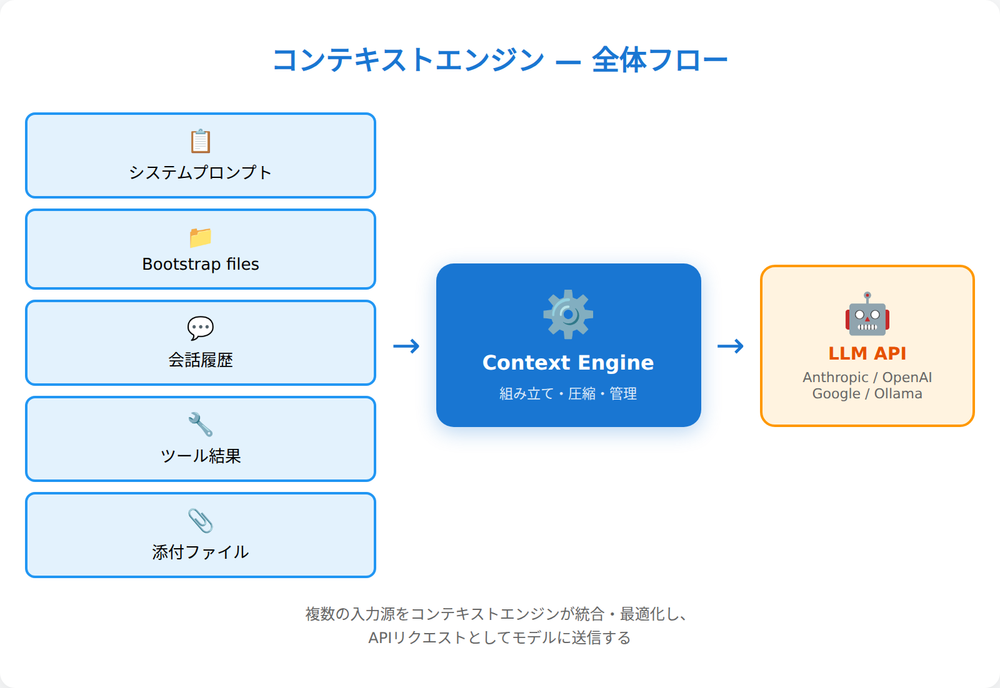

---

## 6.1 コンテキストとは何か — モデルが「見ているもの」の全体像

OpenClawにおけるコンテキストとは、**モデル（Claude、GPT等）に送信されるすべての情報**だ。もう少し具体的に言えば、APIリクエストのbodyに含まれる `messages` 配列と `system` プロンプトの組み合わせである。

### コンテキストの構成要素

OpenClawのコンテキストは、以下の要素から組み立てられる：

1. **システムプロンプト** — エージェントの「人格・役割・制約」を定義。毎回動的に組み立てられる
2. **会話履歴** — user→assistant→user...の過去のやり取り
3. **ツール呼び出し/結果** — function call の入力と出力
4. **添付ファイル** — 画像、PDF等のマルチモーダル入力
5. **Bootstrap files注入** — AGENTS.md、SOUL.md等のプロジェクトファイル

これらを「積み上げて」1つのリクエストにする作業が、コンテキストの組み立てだ。

### コンテキストは「意識の瞬間」

人間で例えよう。システムプロンプトは「性格・価値観・知識」、会話履歴は「今日の体験」、Bootstrap filesは「手帳やメモ帳」だ。これらが組み合わさって「今この瞬間、何を考えているか」が決まる。

OpenClawのエージェントは、毎回のターンで「記憶を失い」「コンテキストを読み直して」「自分が誰か・何を話していたかを思い出す」。LLM APIはステートレスなので、これは自然な動作だ。むしろ、この仕組みだからこそコンテキストを精密にコントロールできる。

### `/context` コマンドで確認してみる

実際のコンテキストを見るには、OpenClawの `/context` コマンドが便利だ：

```bash
/context list    # 現在のメッセージ一覧
/context detail  # 詳細なコンテキスト構造
```

`/context detail` の出力例：

```
🧠 Context breakdown
Workspace: /root/.openclaw/workspace
Bootstrap max/file: 20,000 chars
System prompt (run): 38,412 chars (~9,603 tok)
Messages: 8
  user: "コンテキストエンジンについて教えて"
  assistant: "コンテキストエンジンは..."
  ...
```

この数値が、モデルに送られる「意識の全体量」だ。

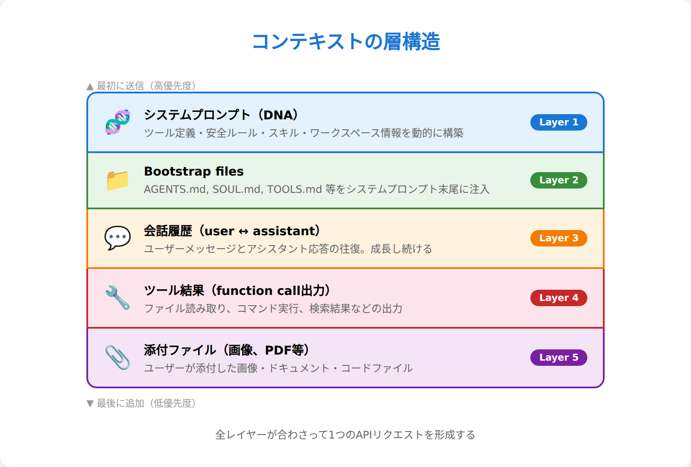

---

## 6.2 システムプロンプトの解剖 — エージェントの「DNA」はどう組み立てられるか

システムプロンプトは、エージェントの基本的な「人格・能力・制約」を定義する文章だ。OpenClawでは、毎回のエージェント実行時に動的に組み立てられる。固定テンプレートではない。

### システムプロンプトの標準構成

OpenClawのシステムプロンプトは、以下のセクションから構成される（順序は固定）：

| # | セクション | 役割 |
|---|-----------|------|
| 1 | **Tooling** | 利用可能なツール一覧と使い方 |
| 2 | **Safety** | 安全性のガイドライン |
| 3 | **Skills** | スキル（専門タスク）の説明 |
| 4 | **Workspace** | ワークスペースの説明 |
| 5 | **Workspace Files (injected)** | Bootstrap files（次節で詳述） |
| 6 | **Sandbox / Runtime** | 実行環境情報 |
| 7 | **Current Date & Time** | 現在日時 |
| その他 | Documentation, Reply Tags, Heartbeats, Reasoning等 | 補助的セクション |

### promptModeによる3つのバリエーション

システムプロンプトの「厚さ」は、`promptMode` で制御される：

| Mode | 対象 | 特徴 |
|------|------|------|
| `full` | メインエージェント | 全セクション含む（デフォルト） |
| `minimal` | サブエージェント | Skills、Memory Recall、Reply Tags、Heartbeats等を省略。ただしTooling、Safety、Workspace、Sandbox、Runtimeは残る。Bootstrap filesはAGENTS.md + TOOLS.md + SOUL.md + IDENTITY.md + USER.mdの5ファイル |
| `none` | 特殊ケース | `"You are a personal assistant running inside OpenClaw."` のみ返す（プラグインがシステムプロンプトを完全に自前で組み立てる場合に使う） |

`minimal` モードのポイントは、「何を省くか」だけでなく「何が残るか」だ。ツール利用や安全性の制約は、サブエージェントにも必ず適用される。

### Bootstrap Files注入（概要）

システムプロンプトの「Workspace Files (injected)」セクションでは、ワークスペース内の特定ファイルが自動的に読み込まれる。この仕組みの詳細は次節（6.3）で解説するが、ここでは全体構造の中での位置づけだけ押さえよう——Bootstrap filesはシステムプロンプトの**一部**であり、他のセクション（Tooling、Safety等）と並んでモデルに注入される。

> 💬 **こうじの実感：** システムプロンプトが毎回動的に組み立てられるのは、実は結構すごいこと。チャンネルが変わったり、サブエージェントを起動したりすると、その瞬間に違う「人格」になる。ファイル一つ変えるだけで全エージェントの基盤が変わるのも面白い。固定テンプレートだったら、こんな柔軟性は実現できない。

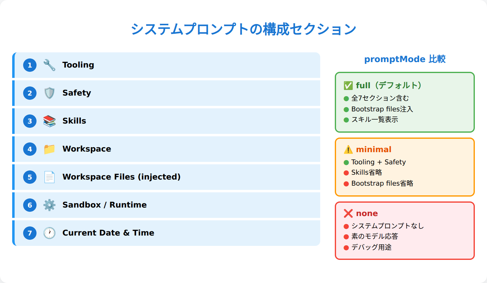

---

## 6.3 Bootstrap Files注入 — プロジェクトコンテキストの自動インポート

Bootstrap files注入は、OpenClawの「最も魔法的な機能」の1つだ。あなたがワークスペースに `SOUL.md` を置くと、それが自動的にシステムプロンプトに組み込まれ、エージェントの人格になる。仕組みを理解すると、この魔法を思い通りにコントロールできる。

### 注入の優先順序

OpenClawは決められた順序でBootstrap filesを探す：

```
1. AGENTS.md      # 最優先（行動指針）
2. SOUL.md        # 人格定義
3. TOOLS.md       # 環境設定
4. IDENTITY.md    # 基本情報
5. USER.md        # ユーザー情報
6. HEARTBEAT.md   # cron設定
7. BOOTSTRAP.md   # 初期化（通常は不要）
8. MEMORY.md      # 長期記憶（メインセッション限定）
#    ※ memory.md（小文字）も自動で検出される
```

ファイルがあれば読む、なければスキップ。この順序は固定だ。

### 文字数制限とキャップ

Bootstrap files注入には2つの制限がある：

1. **ファイル単位制限** — `bootstrapMaxChars`（デフォルト20,000文字）
2. **全体制限** — `bootstrapTotalMaxChars`（デフォルト150,000文字）

1つのファイルが20KB超えると切り詰められ、全体で150KB超えると古いファイルから削除される。切り詰めが発生した場合、`bootstrapPromptTruncationWarning`（デフォルト `once`）の設定に応じてシステムプロンプト内に警告が表示される。

### サブエージェントの制限

サブエージェント（およびcronセッション）の場合、セキュリティと効率性のため、注入されるのは **AGENTS.md、TOOLS.md、SOUL.md、IDENTITY.md、USER.md の5ファイル** だ。HEARTBEAT.md、BOOTSTRAP.md、MEMORY.md は除外される。親エージェントとの主な違いは、長期記憶（MEMORY.md）や起動時処理（HEARTBEAT.md、BOOTSTRAP.md）が省略される点である。

### memory/の特殊扱い

`memory/` ディレクトリ内の日次ファイル（`2026-03-29.md` 等）は、Bootstrap filesとして自動注入**されない**。代わりに、`memory_search` と `memory_get` ツールでオンデマンドアクセスする。

理由は2つ：
1. **サイズの問題** — 日次ファイルは巨大になりがち
2. **アクセスパターン** — 必要な時に必要な分だけ読むほうが効率的

### agent:bootstrapフック

プラグインで bootstrap プロセスをインターセプトできる。`agent:bootstrap` フックにより、注入されるBootstrap filesの差し替えや動的コンテンツの追加が可能だ。

> 💬 **こうじの実感：** Bootstrap files注入は「魔法っぽい」けど、理解すると単純な仕組み。ファイルがあれば読む、なければスキップ。優先順序は固定。メインとサブで制限が違う。この4点だけ覚えておけば十分。逆に、「なぜエージェントが勝手に人格を持つのかわからない」という人は、ワークスペースの `SOUL.md` を見てみよう。その内容がシステムプロンプトにそのまま入っている。

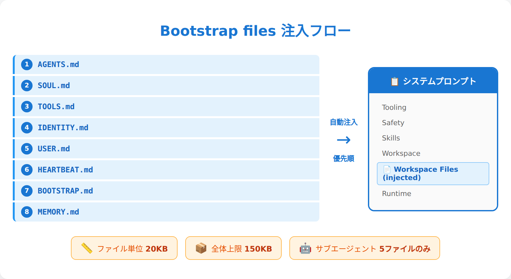

---

## 6.4 コンテキストウィンドウとトークン管理 — 有限性との戦い

AIモデルには「コンテキストウィンドウ」という制限がある。例えば200K tokensのモデルなら、システムプロンプト＋会話履歴＋ツール結果…すべて合わせて200K以内に収める必要がある。会話が長くなったり、大きなファイルを添付したりすると、この制限に引っかかる。OpenClawはこの「有限性との戦い」を、複数の戦略で解決している。

### 3つのコンテキスト最適化戦略 — まず全体像を掴む

本章のこの先で詳しく扱う3つの戦略を、まず比較表で整理しよう：

| | コンパクション（6.5） | プルーニング（6.6） | メモリフラッシュ（6.7） |
|---|---|---|---|
| **何を対象に** | 会話履歴全体 | ツール結果のみ | コンパクションで失われる情報 |
| **いつ発動** | トークン上限に近づいた時 / 手動 `/compact` | Anthropic APIキャッシュTTL期限切れ時 | コンパクション直前に自動 |
| **何をする** | 古い会話を要約して圧縮 | ツール出力をトリム/クリア | memory/ に重要情報を保存 |
| **元データは** | 要約に置換（JSONLに原文保存） | メモリ上のみ削除（JSONLは不変） | 元データは変化しない |
| **デフォルト** | ON | **OFF**（Anthropic API使用時のみ有効化可能）※Smart defaultsにより自動有効化される場合あり | ON |

この表を頭に入れておけば、以降のセクションがスッと入ってくるはずだ。

### トークンカウントの監視

OpenClawは常に現在のトークン使用量を監視している。内部的には `estimateTokensFromMessages()` でリアルタイム推定を行う。

レスポンスごとのトークン使用量を確認したい場合は、`/usage tokens` でフッターモードを有効にできる：

```bash
/usage tokens   # 各レスポンスの末尾にトークン使用量を表示
/usage off      # フッター表示をオフ
/usage full     # 詳細な使用量フッター
/usage cost     # ローカルコスト集計
```

これは「独立した統計コマンド」ではなく、**通常のレスポンスに使用量フッターを追加するモード切替**だ。有効にすると、以降のレスポンスの末尾にトークン数が表示される。

### トークン推定の精度問題

OpenClawのトークンカウントは「推定値」だ。正確な値はAPIコール時にしかわからない。そのため、実際の制限より少し手前で保護機能を発動させている。

### モデル別の特殊対応

モデルによって制限値が違うため、OpenClawは動的に制限を調整する。また、OpenAI APIの場合は**サーバーサイドコンパクション**（`store` + `context_management`）もサポートしている。これにより、コンテキスト管理をOpenAI側に委託できる。

> 💬 **こうじの実感：** トークン制限で一番厄介なのは、「突然エラーで止まる」こと。推定が甘くて、長文のツール結果を取得した瞬間に制限オーバー、みたいな。OpenClawの自動コンパクションは、そういう「突然死」を防ぐ保険みたいなもの。制限が心配なら、`/usage tokens` でフッター表示を有効にして残量を意識する習慣をつけよう。

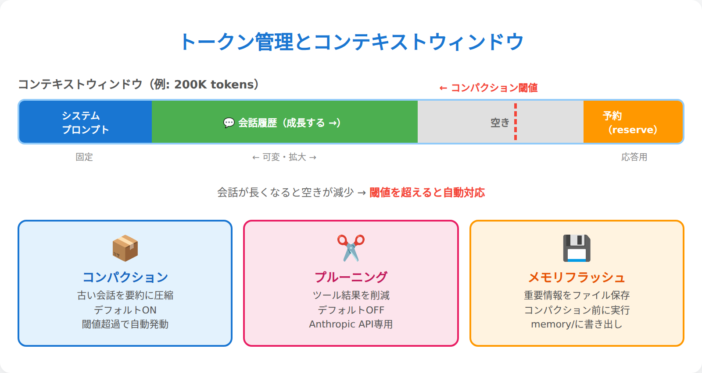

---

## 6.5 コンパクション — 古い会話を要約する自動記憶術

コンパクション（Compaction）は、コンテキストウィンドウがいっぱいになったときに古い会話を要約してスペースを確保する機能だ。人間が「昨日の詳細は忘れたけど、大筋は覚えている」のと似ている。

### コンパクションの発動タイミング

ざっくり言えば、コンテキスト上限に近づいたら発動する。具体的には以下の条件で自動発動する：

1. **トークン推定値が閾値を超過** — `reserveTokensFloor`（デフォルト20,000トークン）を基準に、モデルのcontextWindowに対して十分な余裕を確保するよう計算される。ざっくり言えば、コンテキスト上限の90%くらいを使い切ったあたりで発動する
2. **次のメッセージを追加するとオーバーフローする予測**

発動前に、OpenClawは**自動メモリフラッシュ**を実行する（6.7節参照）。これにより、要約されて失われる情報の一部を memory/ に保存する。

### コンパクションプロセス

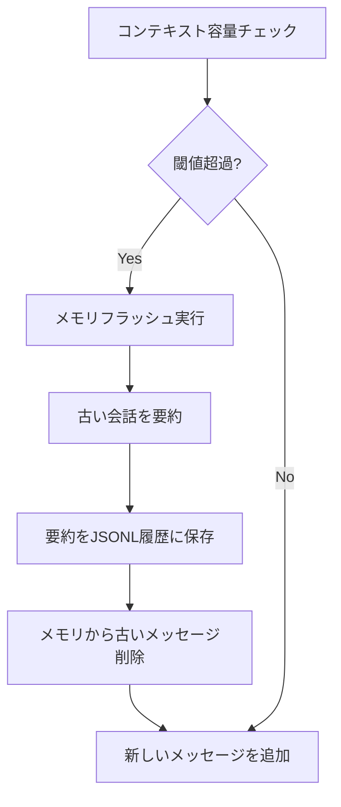

### コンパクションのbefore/after

コンパクション前後で何が起きるか、具体例で見てみよう：

**Before（コンパクション前）:**
```
user: "Reactのプロジェクト構成を考えて"
assistant: "src/components/, src/hooks/, src/utils/ の3層構造がおすすめ..."（詳細な150行の提案）
user: "hooks/のファイル名規約は？"
assistant: "useXxx.ts の形式で、カスタムフック名にはuse接頭辞を..."（50行の解説）
user: "テストどうする？"
assistant: "__tests__/配下にコンポーネント単位で..."（80行の解説）
...（さらに20往復の詳細議論）
```

**After（コンパクション後）:**
```
[summary]: "Reactプロジェクト構成を議論。src/components・hooks・utilsの3層構造を採用。hooks命名規約はuseXxx.ts、テストは__tests__配下にコンポーネント単位で配置することに決定。主要な技術選定: React Router v7、Zustand、Vitest。未解決: CI/CDパイプラインの設計。"
user: "CI/CDの話をしよう"  ← ここから通常の会話が続く
```

20往復以上の詳細議論が、数行の要約に圧縮される。大筋と決定事項は残るが、細かいやり取りは消える。

### 手動コンパクション

`/compact` コマンドで手動実行も可能：

```bash
/compact                          # 標準要約
/compact important details only   # カスタム指示付き
```

カスタム指示を使えば、要約の観点を指定できる。例えば「重要な決定事項のみを残す」「技術的詳細は省略」等。

### 要約の品質制御

要約の品質を保つため、以下の設定がある：

- **identifierPolicy: strict** — 人名、コード、URLなど「不透明な識別子」を要約で失わないよう保護
- **コンパクションモデル** — 要約専用の軽量モデルを指定可能（`agents.defaults.compaction.model`）

### OpenAIの場合の特殊対応

OpenAI APIユーザーは、`store` + `context_management` によるサーバーサイドコンパクションも利用できる。この場合、要約処理をOpenAI側が担当する。

> 💬 **こうじの実感：** コンパクションの体感は「昨日の記憶が朧げになった」感じ。詳細な会話内容は忘れるけど、要約で大筋は覚えている。手動で `/compact` を叩くと、その瞬間に「記憶がぼんやりする」のがリアルタイムで実感できて面白い。長期にわたる複雑なプロジェクトでは、定期的に手動コンパクションして「記憶を整理」するのがおすすめ。

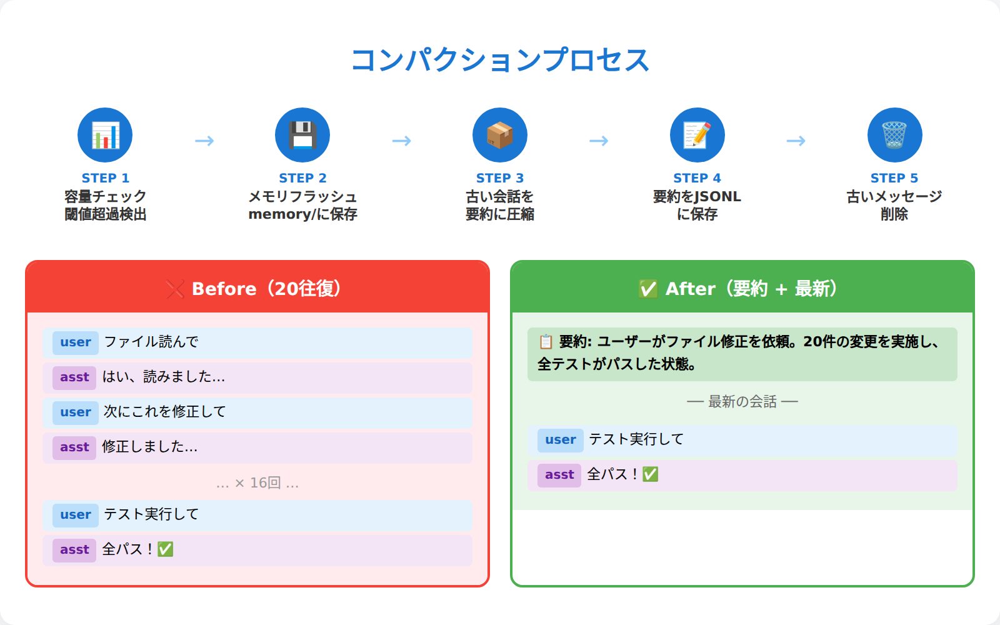

---

## 6.6 セッションプルーニング — Anthropic APIキャッシュコストの最適化

> **📌 Anthropic APIを使っていない人はスキップOK**

セッションプルーニング（Session Pruning）は、コンパクションとは全く異なるメカニズムで、異なる目的を持つ機能だ。**Anthropic API専用**であり、**デフォルトではOFF**。

Anthropic APIのキャッシュ機能は、同じプロンプトの再利用でAPIコストを削減する仕組みだが、一定時間（TTL: Time To Live）が経過すると期限切れになり、再キャッシュ時に料金が発生する。

### プルーニングの本当の目的

プルーニングの主目的は、**Anthropic APIのプロンプトキャッシュコスト最適化**だ。Anthropicのキャッシュは一定時間（TTL: Time To Live）内のリクエストにのみ適用される。TTL期限切れ後にリクエストを送ると、全プロンプトが再キャッシュされ、cacheWrite料金が発生する。

プルーニングは、TTL期限切れ時に古いツール結果を削除することで、再キャッシュされるデータ量を減らし、コストを抑える。

### 有効化の方法

```json5
// デフォルト（OFF）
{ agents: { defaults: { contextPruning: { mode: "off" } } } }

// cache-ttlモードで有効化（Anthropic API使用時）
{ agents: { defaults: { contextPruning: { mode: "cache-ttl", ttl: "5m" } } } }
```

Anthropicプロファイルを使用している場合、Smart defaultsにより自動的に有効化されることがある。

### プルーニングの対象

削除されるのは**ツール結果（function call の出力）のみ**。会話履歴やシステムプロンプトは残る。ただし、**画像を含むツール結果**はスキップされる（再取得できないため）。

### ソフトトリムとハードクリア

プルーニングには2つのモードがある：

#### ソフトトリム（softTrimRatio: 0.3）
先頭1,500文字と末尾1,500文字を残し、中間を `...` に置換。4,000文字を超えるツール結果が対象：

```
元: "line1\nline2\nline3\n...line100\n（合計8,000文字）"
後: "line1\nline2...\n...\nline100\n[Tool result trimmed: kept first 1500 chars and last 1500 chars of 8000 chars.]"
```

#### ハードクリア（hardClearRatio: 0.5）
内容を完全に削除し、プレースホルダーのみ残す：

```
[Old tool result content cleared]
```

### keepLastAssistants保護

最新の3つのアシスタントメッセージ以降のツール結果は削除されない（`keepLastAssistants: 3`）。直近の文脈を保護するためだ。

### ディスクファイルは不変

重要な点は、プルーニングは**メモリ上のコンテキストのみ**を操作し、ディスクの `.jsonl` ファイルは変更しないこと。つまり、削除されたツール結果は `openclaw logs` で後から確認できる。

> 💬 **こうじの実感：** プルーニングは「一時的な忘却」。コンパクションが「記憶の要約」なら、プルーニングは「キャッシュ効率のために古い資料を片付ける」感覚。Anthropic APIを使っていない人は、このセクションは読み飛ばしてOK。逆にAnthropic APIユーザーなら、cache-ttlモードの有効化でAPIコストを最適化できるから、覚えておいて損はない。

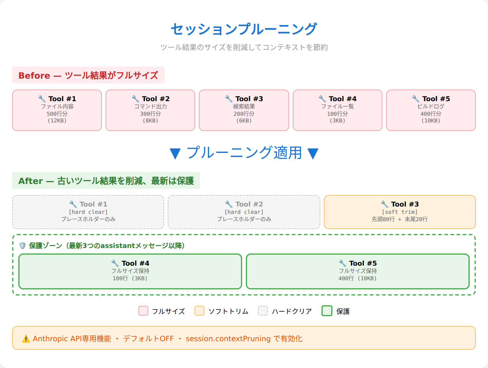

---

## 6.7 メモリフラッシュ — コンパクション前の自動保存

メモリフラッシュは、コンパクションで失われる情報を自動的に `memory/` に保存する機能だ。「大事な話をする前に、今の話をメモに残しておく」という人間的な行動をエージェントが自動実行する。

### フラッシュのタイミング

メモリフラッシュは、コンパクション実行の**直前**に自動発動する。コンパクションの閾値に近づいた時点（`softThresholdTokens` のマージンを加味）でトリガーされる。

```
1. コンテキスト容量チェック → 閾値超過を検出
2. メモリフラッシュ実行 → サイレントターンで memory/ に保存
3. コンパクション実行 → 古い会話を要約
4. 新しいメッセージ追加
```

### サイレントターンの仕組み

メモリフラッシュは「サイレントターン」として実行される。これは、ユーザーに見えない内部的なエージェント起動だ。エージェントが会話内容を要約し、`Write` ツールで `memory/YYYY-MM-DD.md` に保存する。

このとき、エージェントには「セッションがコンパクションに近づいているため、重要な記憶を `memory/YYYY-MM-DD.md` に保存せよ」という趣旨のプロンプトが与えられる。Bootstrap filesやSOUL.md等のワークスペースファイルは読み取り専用として保護され、上書きされることはない

**注意:** サイレントターンは追加のAPI呼び出しを伴うため、トークンコストが若干増える。コンパクション1回ごとにフラッシュ用の呼び出しが発生する点は意識しておこう。

### 保存される情報の種類

メモリフラッシュでは、以下の情報が優先的に保存される：

- 重要な決定事項
- タスクの進行状況
- 学んだ教訓・気づき
- 今後の予定・TODO
- 失敗やエラーの記録

逆に、一時的な雑談や、既に結果が出た議論は省略されることが多い。

### 設定パラメータ

メモリフラッシュの動作は以下の設定で調整できる：

```json5
{
  agents: { defaults: { compaction: {
    reserveTokensFloor: 20000,    // コンパクション用の予約トークン
    memoryFlush: {
      enabled: true,              // true/falseで切替
      softThresholdTokens: 4000,  // フラッシュ発動の追加マージン
    }
  }}}
}
```

### 手動メモリ保存

自動フラッシュとは別に、会話中に「これをメモリに保存して」と依頼すれば、エージェントが `Write` ツールで memory/ に記録してくれる。重要な情報をすぐに記録したい場合に有効だ。

> 💬 **こうじの実感：** メモリフラッシュは「無意識の記録」みたいなもの。エージェントが「あ、そろそろ忘れそうだから、大事なことをメモしておこう」と勝手に判断して実行する。人間でも、長い会議の途中で「いったん議事録を整理しておこう」ってやることがあるでしょう？あれのAI版。ユーザーが意識しなくても、重要な情報は自動で保存される仕組み。

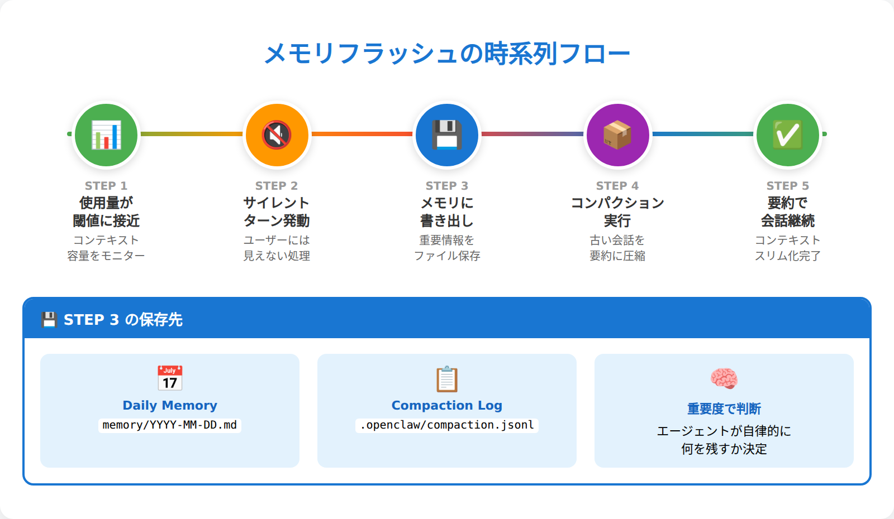

---

## 6.8 コンテキストエンジンのプラガブル化 — 4つのライフサイクル

> **📌 上級者向けセクション**
> 6.1〜6.7はデフォルトの `legacy` エンジンの動作を解説した。ほとんどのユーザーはlegacyエンジンで十分だ。ここからは、この仕組み自体を独自のプラグインで差し替えたい開発者向けの話になる。「今は必要ない」と感じたら、6.9（実践）に飛んでOK。

OpenClawのコンテキスト管理はプラガブル（交換可能）だ。デフォルトの `legacy` エンジン以外に、独自のコンテキストエンジンをプラグインで実装できる。この拡張性を支えるのが、4つのライフサイクルフックだ。

### legacyエンジンの正体

まず、デフォルトの `legacy` エンジンが実際に何をしているか正確に理解しよう：

| ライフサイクル | legacyの実装 |
|---|---|
| **Ingest** | **no-op**（何もしない）。メッセージの永続化はセッションマネージャーが担当 |
| **Assemble** | **パススルー**。ランタイム側の sanitize → validate → limit パイプラインに委譲 |
| **Compact** | 組み込みの要約コンパクションに委譲 |
| **After Turn** | **no-op**（何もしない） |

つまり、Bootstrap files注入やプルーニングといった機能はエンジンではなく**ランタイム側**が処理している。legacyエンジンは「ランタイムの既存処理に任せる」薄いラッパーだ。

### 4つのライフサイクルポイント

カスタムエンジンを作る場合、以下の4つのタイミングにフックできる：

#### 1. **Ingest**（メッセージ追加時）
新しいユーザーメッセージやツール結果がセッションに追加される際に呼ばれる。

#### 2. **Assemble**（モデル実行前）
エージェント実行直前に、最終的なコンテキストを組み立てる。

```javascript
async assemble(params) {
  // params にはsessionId、currentMessages、contextWindow等が含まれる
  return {
    messages: [...],
    estimatedTokens: 4500,        // 必須：トークン推定値
    systemPromptAddition: "..."   // 任意：動的追加テキスト
  };
}
```

`systemPromptAddition` を使えば、例えば「RAGで外部DBの関連情報を検索して注入」といった拡張が可能だ。

#### 3. **Compact**（コンテキストウィンドウ満杯時）
コンテキストサイズが制限を超えた際の圧縮処理。`ownsCompaction` フラグで動作が変わる：

- **`ownsCompaction: true`** — エンジンがコンパクション処理を完全に管理。ランタイムの自動コンパクションは無効化
- **`ownsCompaction: false`（デフォルト）** — ランタイムの自動コンパクションが動作。ただし、`/compact` コマンドやオーバーフローリカバリ時にはactive engineの `compact()` も呼ばれる

#### 4. **After Turn**（実行完了後）
エージェントの実行が完了した後の後処理。統計取得やクリーンアップに使う。

### エンジン選択の仕組み

使用するコンテキストエンジンは `plugins.slots.contextEngine` で指定する。この設定は**排他的**で、同時に複数のエンジンを有効にはできない。

**⚠️ 重要:** エンジンの登録に失敗した場合や、指定されたエンジンIDが解決できない場合、OpenClawは**自動フォールバックしない**。プラグインを修正するか `legacy` に切り替えるまで、実行は失敗し続ける。

### サブエージェントライフサイクル

コンテキストエンジンには、サブエージェント専用のフックもある：

- **onSubagentEnded** — サブエージェント終了時の処理

> 💬 **こうじの実感：** 4つのライフサイクルは、人間の「意識の流れ」に対応している。Ingest＝「聞く」、Assemble＝「考える」、Compact＝「忘れる」、After Turn＝「振り返る」。カスタムエンジンを作るなら、まず legacy エンジンのコードを読むのがおすすめ。ただし、legacyはほぼno-opだから、実質的なロジックはランタイム側にある。その「ランタイムが何をやっているか」を理解することが、カスタムエンジン開発の第一歩だ。

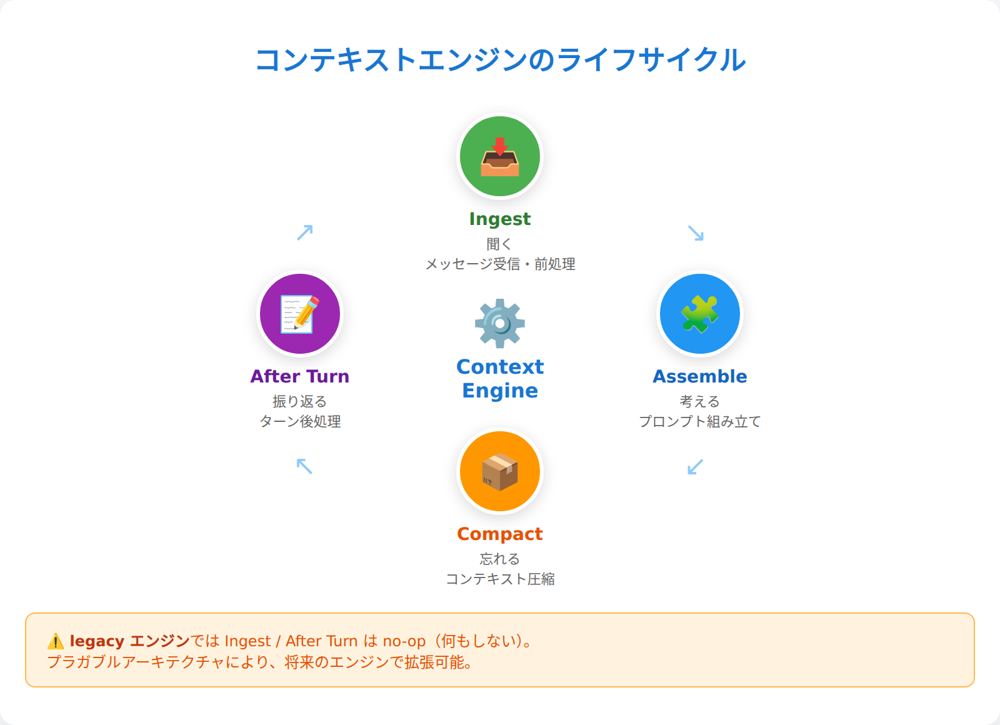

---

## 6.9 実践：コンテキスト管理のコマンドとテクニック

理論は十分理解した。ここでは、実際にOpenClawを使ってコンテキスト管理を実践するためのコマンドとテクニックを紹介する。

### 基本的なコンテキスト確認

```bash
# 現在のコンテキスト構造を確認
/context list

# 詳細なコンテキスト構造（トークン数、Bootstrap情報等）
/context detail

# レスポンスにトークン使用量フッターを追加
/usage tokens

# セッション履歴を確認（ディスク上のJSONL）
openclaw logs <sessionId>

# 現在のセッションIDを取得
/status
```

### コンパクション関連

```bash
# 手動コンパクション（標準）
/compact

# カスタム指示付きコンパクション
/compact 重要な技術情報のみを残してください

# セッション一覧
openclaw sessions
```

### メモリ関連のベストプラクティス

```bash
# 今日のメモリを確認
cat memory/$(date +%Y-%m-%d).md

# メモリ検索（会話中にツールとして利用）
# → memory_search ツールをエージェントが使用
# 「○○について過去のメモリを検索して」と依頼すればOK

# 手動メモリ保存
# （会話中で「これをメモリに保存して」と依頼）
```

### トラブルシューティング

#### 突然のコンテキストエラー

```bash
# トークン使用量フッターを有効化して確認
/usage tokens

# 手動コンパクションで空きを作る
/compact

# セッションリセット（最終手段）
/reset
```

#### Bootstrap files が反映されない

```bash
# ワークスペースを確認
pwd
ls -la *.md

# ファイルサイズをチェック（20,000文字制限に注意）
wc -c *.md

# システムプロンプトに含まれているか確認
/context detail
```

#### メモリが蓄積されない

```bash
# memory/ディレクトリの状況確認
ls -la memory/

# 最近のメモリ変更を確認
tail -20 memory/$(date +%Y-%m-%d).md
```

### 上級者向けテクニック

#### 戦略的コンパクション

長期プロジェクトでは、節目ごとに戦略的コンパクションを行う：

```bash
# プロジェクトの区切りで要約
/compact このフェーズで学んだ教訓とNext Actionのみを残してください

# 技術的詳細を整理
/compact 実装詳細は省略し、設計思想と課題のみ残してください
```

> 💬 **こうじの実感：** コンテキスト管理で一番大事なのは「定期的な可視化」。`/usage tokens` でフッターを有効にして、残りトークンを意識する。閾値に近づいたら手動コンパクションを検討。あと、Bootstrap files は「育てる」もの。最初は短く書いて、使いながら徐々に改善していく。いきなり完璧を目指さない。

---

## この章で学んだこと

第6章では、OpenClawの「意識の仕組み」——コンテキストエンジンを詳しく解剖した。

### 重要なポイント

1. **コンテキストは「意識の瞬間」** — システムプロンプト + 会話履歴 + ツール結果 + Bootstrap files の組み合わせ
2. **システムプロンプトの構造** — 毎回動的に組み立てられる構造化された「人格・能力・制約」。promptModeで厚さを制御
3. **Bootstrap files注入** — ワークスペースのファイルが自動的にエージェントの基礎知識になる。ファイル単位20KB、全体150KBの制限あり
4. **3つのコンテキスト最適化戦略** — コンパクション（会話要約・全モデル共通）・プルーニング（Anthropic API専用・デフォルトOFF・キャッシュコスト最適化）・メモリフラッシュ（コンパクション前の情報自動保存）
5. **legacyエンジンの正体** — Ingest/AfterTurnはno-op。実質的な処理はランタイム側が担当
6. **4つのライフサイクル** — Ingest・Assemble・Compact・After Turnでプラガブルなアーキテクチャ

### 実践で使えるコマンド

- `/context detail` でコンテキスト構造を確認
- `/usage tokens` でレスポンスにトークン使用量フッターを追加
- `/compact` で手動要約・整理
- `/reset` で新しい会話を開始

### 次章への橋渡し

コンテキストという「器の中身」を理解した。次は「外の世界との接続」だ。第7章では、Discord・WhatsApp・Slack等、OpenClawがどのようにチャンネルに接続するかを扱う。

---

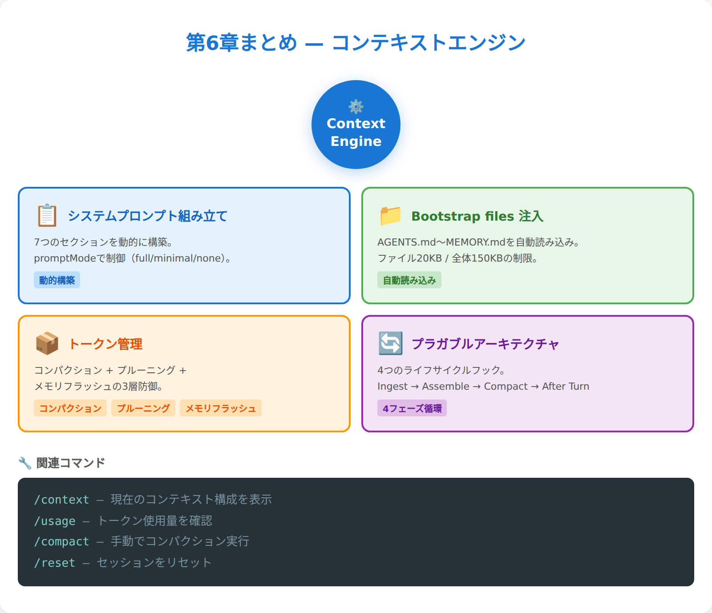

**第6章完了。エージェントの「意識のメカニズム」を習得。**
